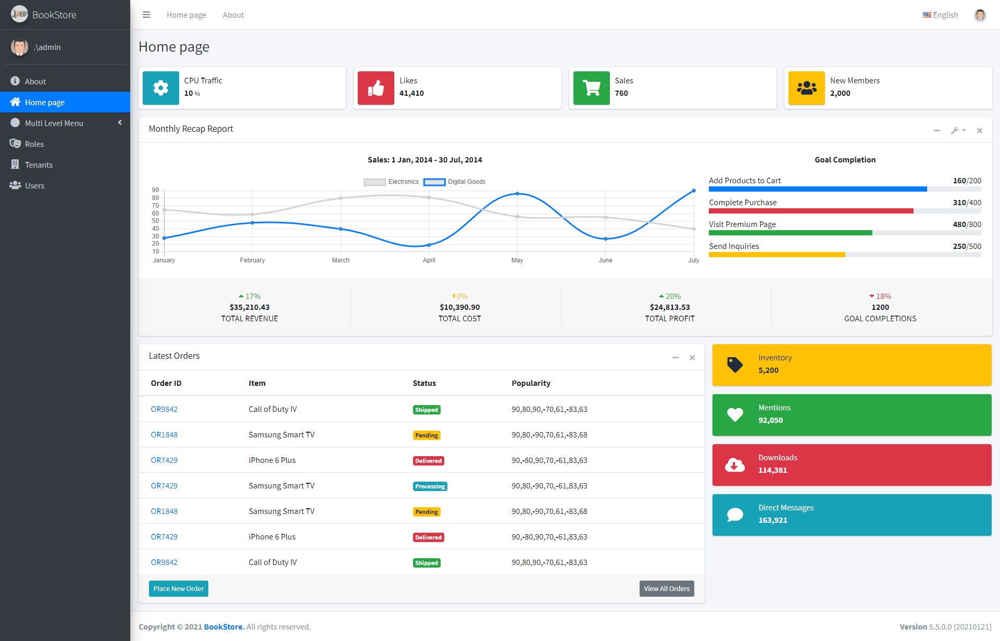

# ASP.NET Boilerplate (PostSharp Edition)

[](https://www.nuget.org/packages/Emisand.Abp.PostSharp)
[](https://www.nuget.org/packages/Emisand.Abp.PostSharp)

## About this fork

This fork adds [PostSharp](https://www.postsharp.net/) aspects to ASP.NET Boilerplate, replacing the Castle DynamicProxy interceptors for added performance.

In order to use this fork with PostSharp, please refer to the next section.

For anything else, refer to the original [ASP.NET Boilerplate repository](https://github.com/aspnetboilerplate/aspnetboilerplate), and the original [ASP.NET Boilerplate Documentation](https://aspnetboilerplate.com/Pages/Documents)

## How to use this fork?

#### 1. Get a PostSharp license
First of all, you will need a PostSharp community or a PostSharp framework license, [read this](https://www.postsharp.net/pricing) to learn more about their licensing program.
Please note that the community license is limited to 1000 enhanced lines of code, but you can try their ultimate license for free for 45 days to verify if this solution is good for you.

#### 2. Replace Abp packages with Emisand.Abp.PostSharp
Assuming that you already have a solution that uses ASP.NET Boilerplate, you will have to replace all your *Abp.\** package references to *Emisand.Abp.PostSharp.\**, this replaces all the original Abp packages with PostSharp enhanced packages.

#### 3. Install the PostSharp NuGet package
You will also have to add a reference to the PostSharp package too all of your projects that implement `IApplicationService`, `IRepository` or any of their derived classes, or use any of the following attributes: `AbpAuthorize`, `Audited`, `RequiresFeature`, `UnitOfWork` or `UseCase`.

If you have a *.props* files included at all of your solution projects, like the *common.props* file included in the ASP.NET Zero solution, then just add the following package reference to the props file so it looks like this:
```XML
<Project>
    <ItemGroup>
        <PackageReference Include="PostSharp" Version="6.9.5">
            <PrivateAssets>All</PrivateAssets>
        </PackageReference>
    </ItemGroup>
</Project>

```

#### 4. Add a PostSharp config file to your solution
Then, you will have to add a PostSharp configuration file named *postsharp.config* to the root folder of your solution (same folder as your .sln files) with the following contents, replacing *YOUR_LICENSE_CODE* with your own PostSharp license:

```XML
<?xml version="1.0" encoding="utf-8"?>
<Project xmlns="http://schemas.postsharp.org/1.0/configuration">
	<License Value="YOUR_LICENSE_CODE" />
	<Multicast>
		<AuthorizationAspectProvider xmlns="clr-namespace:Abp.Authorization;assembly:Abp" />
		<AuditingAspectProvider xmlns="clr-namespace:Abp.Auditing;assembly:Abp" />
		<EntityHistoryAspectProvider xmlns="clr-namespace:Abp.EntityHistory;assembly:Abp" />
		<UnitOfWorkAspectProvider xmlns="clr-namespace:Abp.Domain.Uow;assembly:Abp" />
		<ValidationAspectProvider xmlns="clr-namespace:Abp.Runtime.Validation.Interception;assembly:Abp" />
	</Multicast>
</Project>
```

#### 5. Enable PostSharp when Initializing Abp in your web projects
Finally, you have to find the `AddAbp()` call in your Startup class and add a line to the *options* lambda like this: `options.EnablePostSharp = true;`

Example:

```C#
public class Startup
{
    public IServiceProvider ConfigureServices(IServiceCollection services)
    {
        //...

        //Configure Abp and Dependency Injection. Should be called last.
        return services.AddAbp<MyProjectWebModule>(options =>
        {
            // Enable PostSharp
            options.EnablePostSharp = true;
            
            //Configure Log4Net logging (optional)
            options.IocManager.IocContainer.AddFacility<LoggingFacility>(
                f => f.UseLog4Net().WithConfig("log4net.config")
            );
        });
    }

    public void Configure(IApplicationBuilder app, IHostingEnvironment env, ILoggerFactory loggerFactory)
    {
        //Initializes ABP framework and all modules. Should be called first.
        app.UseAbp();

        //...
    }
}
```
#### 6. Build your solution
Once all of this has been done and you **rebuild** your solution, PostSharp aspects will be applied to your code at compilation.

#### Notes:
If you do not add the `options.EnablePostSharp = true;` to your Startup class, then Abp will use the default Castle DynamicProxy interceptors and not use any of the implemented PostSharp aspects.

# Original ABP Readme

## What is ABP?

ASP.NET Boilerplate is a general purpose **application framework** specially designed for new modern web applications. It uses already **familiar tools** and implements **best practices** around them to provide you a **SOLID development experience**.

ASP.NET Boilerplate works with the latest **ASP.NET Core** & **EF Core** but also supports ASP.NET MVC 5.x & EF 6.x as well.

###### Modular Design

Designed to be <a href="https://aspnetboilerplate.com/Pages/Documents/Module-System" target="_blank">**modular**</a> and **extensible**, ABP provides the infrastructure to build your own modules, too.

###### Multi-Tenancy

**SaaS** applications made easy! Integrated <a href="https://aspnetboilerplate.com/Pages/Documents/Multi-Tenancy" target="_blank">multi-tenancy</a> from database to UI.

###### Well-Documented

Comprehensive <a href="https://aspnetboilerplate.com/Pages/Documents" target="_blank">**documentation**</a> and quick start tutorials.

## How It Works

Don't Repeat Yourself! ASP.NET Boilerplate automates common software development tasks by convention. You focus on your business code!


See the <a href="https://aspnetboilerplate.com/Pages/Documents/Introduction" target="_blank">Introduction</a> document for more details.

## Layered Architecture

ABP provides a layered architectural model based on **Domain Driven Design** and provides a **SOLID** model for your application.


See the <a href="https://aspnetboilerplate.com/Pages/Documents/NLayer-Architecture" target="_blank">NLayer Architecture</a> document for more details.

# Module Zero

## What is 'Module Zero'?

This is an <a href="https://aspnetboilerplate.com/" target="_blank">ASP.NET Boilerplate</a> module integrated with Microsoft <a href="https://docs.microsoft.com/en-us/aspnet/identity/overview/getting-started/introduction-to-aspnet-identity" target="_blank">ASP.NET Identity</a>.

Implements abstract concepts of ASP.NET Boilerplate framework:

* <a href="https://aspnetboilerplate.com/Pages/Documents/Setting-Management" target="_blank">Setting store</a>
* <a href="https://aspnetboilerplate.com/Pages/Documents/Audit-Logging" target="_blank">Audit log store</a>
* <a href="https://aspnetboilerplate.com/Pages/Documents/Background-Jobs-And-Workers" target="_blank">Background job store</a>
* <a href="https://aspnetboilerplate.com/Pages/Documents/Feature-Management" target="_blank">Feature store</a>
* <a href="https://aspnetboilerplate.com/Pages/Documents/Notification-System" target="_blank">Notification store</a>
* <a href="https://aspnetboilerplate.com/Pages/Documents/Authorization" target="_blank">Permission checker</a>

Also adds common enterprise application features:

* **<a href="https://aspnetboilerplate.com/Pages/Documents/Zero/User-Management" target="_blank">User</a>, <a href="https://aspnetboilerplate.com/Pages/Documents/Zero/Role-Management" target="_blank">Role</a> and <a href="https://aspnetboilerplate.com/Pages/Documents/Zero/Permission-Management" target="_blank">Permission</a>** management for applications that require authentication and authorization.
* **<a href="https://aspnetboilerplate.com/Pages/Documents/Zero/Tenant-Management" target="_blank">Tenant</a> and <a href="https://aspnetboilerplate.com/Pages/Documents/Zero/Edition-Management" target="_blank">Edition</a>** management for SaaS applications.
* **<a href="https://aspnetboilerplate.com/Pages/Documents/Zero/Organization-Units" target="_blank">Organization Units</a>** management.
* **<a href="https://aspnetboilerplate.com/Pages/Documents/Zero/Language-Management" target="_blank">Language and localization</a> text** management.
* **<a href="https://aspnetboilerplate.com/Pages/Documents/Zero/Identity-Server" target="_blank">Identity Server 4</a>** integration.

Module Zero packages define entities and implement base domain logic for these concepts.

## Startup Templates

You can create your project from startup templates to easily start with Module Zero:

* <a href="https://aspnetboilerplate.com/Pages/Documents/Zero/Startup-Template-Angular" target="_blank">ASP.NET Core & Angular</a> based startup project.
* <a href="https://aspnetboilerplate.com/Pages/Documents/Zero/Startup-Template-Core" target="_blank">ASP.NET Core MVC & jQuery</a> based startup project.
* <a href="https://aspnetboilerplate.com/Pages/Documents/Zero/Startup-Template" target="_blank">ASP.NET Core MVC 5.x / AngularJS</a> based startup project.
 
A screenshot of the ASP.NET Core based startup template:



## Links

* Web site & Documentation: https://aspnetboilerplate.com
* Questions & Answers: https://stackoverflow.com/questions/tagged/aspnetboilerplate?sort=newest

## License

[MIT](LICENSE).
