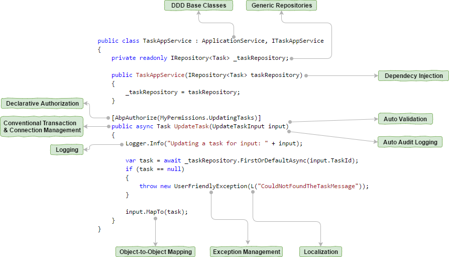
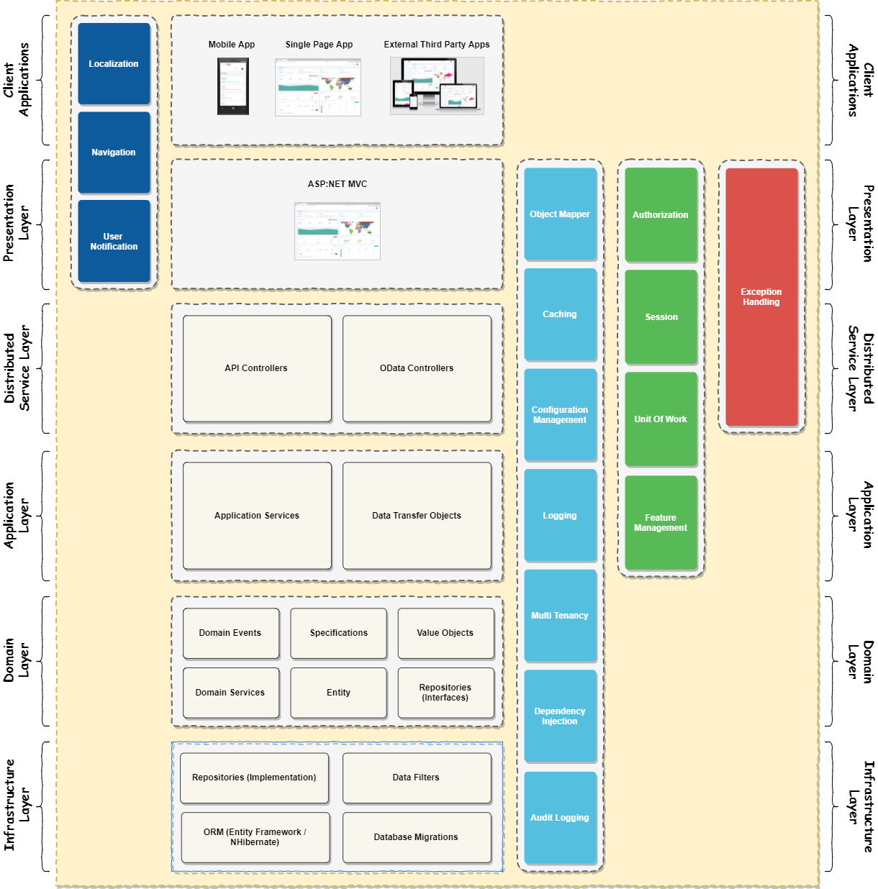
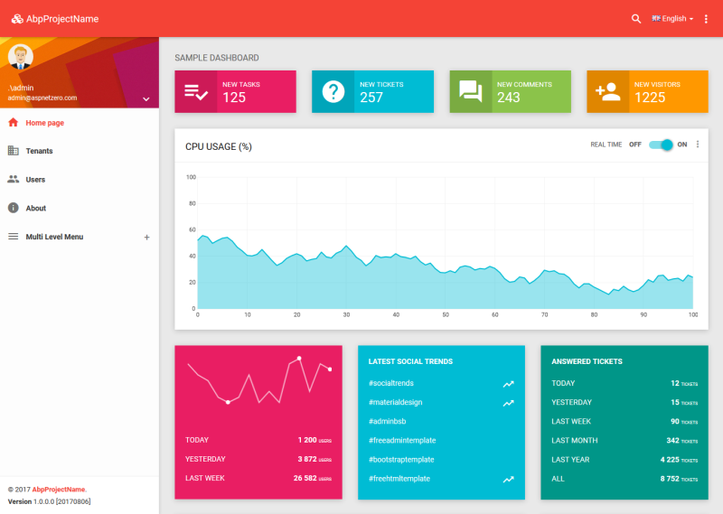

# ASP.NET Boilerplate

[](http://ci.volosoft.com:5480/blue/organizations/jenkins/aspnet-boilerplate-nightly/activity)
[](https://www.nuget.org/packages/Abp)
[](https://www.nuget.org/packages/Abp)
[](https://aspnetboilerplate.com/Pages/Documents/Nightly-Builds)
## What is ABP?

ASP.NET Boilerplate is a general purpose **application framework** specially designed for new modern web applications. It uses already **familiar tools** and implements **best practices** around them to provide you a **SOLID development experience**.

ASP.NET Boilerplate works with the latest **ASP.NET Core** & **EF Core** but also supports ASP.NET MVC 5.x & EF 6.x as well.

###### Modular Design

Designed to be <a href="https://aspnetboilerplate.com/Pages/Documents/Module-System" target="_blank">**modular**</a> and **extensible**, ABP provides the infrastructure to build your own modules, too.

###### Multi-Tenancy

**SaaS** applications made easy! Integrated <a href="https://aspnetboilerplate.com/Pages/Documents/Multi-Tenancy" target="_blank">multi-tenancy</a> from database to UI.

###### Well-Documented

Comprehensive <a href="https://aspnetboilerplate.com/Pages/Documents" target="_blank">**documentation**</a> and quick start tutorials.

## How It Works

Don't Repeat Yourself! ASP.NET Boilerplate automates common software development tasks by convention. You focus on your business code!



See the <a href="https://aspnetboilerplate.com/Pages/Documents/Introduction" target="_blank">Introduction</a> document for more details.

## Layered Architecture

ABP provides a layered architectural model based on **Domain Driven Design** and provides a **SOLID** model for your application.



See the <a href="https://aspnetboilerplate.com/Pages/Documents/NLayer-Architecture" target="_blank">NLayer Architecture</a> document for more details.

## Nuget Packages

ASP.NET Boilerplate is distributed as NuGet packages.

|Package|Status|
|:------|:-----:|
|Abp|[](https://badge.fury.io/nu/Abp)|
|Abp.AspNetCore|[](https://badge.fury.io/nu/Abp.AspNetCore)|
|Abp.Web.Common|[](https://badge.fury.io/nu/Abp.Web.Common)|
|Abp.Web|[](https://badge.fury.io/nu/Abp.Web)|
|Abp.Web.Mvc|[](https://badge.fury.io/nu/Abp.Web.Mvc)|
|Abp.Web.Api|[](https://badge.fury.io/nu/Abp.Web.Api)|
|Abp.Web.Api.OData|[](https://badge.fury.io/nu/Abp.Web.Api.OData)|
|Abp.Web.Resources|[](https://badge.fury.io/nu/Abp.Web.Resources)|
|Abp.Web.SignalR|[](https://badge.fury.io/nu/Abp.Web.SignalR)|
|Abp.Owin|[](https://badge.fury.io/nu/Abp.Owin)|
|Abp.EntityFramework.Common|[](https://badge.fury.io/nu/Abp.EntityFramework.Common)|
|Abp.EntityFramework|[](https://badge.fury.io/nu/Abp.EntityFramework)|
|Abp.EntityFramework.GraphDiff|[](https://badge.fury.io/nu/Abp.EntityFramework.GraphDiff)|
|Abp.EntityFrameworkCore|[](https://badge.fury.io/nu/Abp.EntityFrameworkCore)|
|Abp.NHibernate|[](https://badge.fury.io/nu/Abp.NHibernate)|
|Abp.Dapper|[](https://badge.fury.io/nu/Abp.Dapper)|
|Abp.FluentMigrator|[](https://badge.fury.io/nu/Abp.FluentMigrator)|
|Abp.AspNetCore|[](https://badge.fury.io/nu/Abp.AspNetCore)|
|Abp.AspNetCore.SignalR|[](https://badge.fury.io/nu/Abp.AspNetCore.SignalR)|
|Abp.AutoMapper|[](https://badge.fury.io/nu/Abp.AutoMapper)|
|Abp.HangFire|[](https://badge.fury.io/nu/Abp.HangFire)|
|Abp.HangFire.AspNetCore|[](https://badge.fury.io/nu/Abp.HangFire.AspNetCore)|
|Abp.Castle.Log4Net|[](https://badge.fury.io/nu/Abp.Castle.Log4Net)|
|Abp.RedisCache|[](https://badge.fury.io/nu/Abp.RedisCache)|
|Abp.RedisCache.ProtoBuf|[](https://badge.fury.io/nu/Abp.RedisCache.ProtoBuf)|
|Abp.MailKit|[](https://badge.fury.io/nu/Abp.MailKit)|
|Abp.Quartz|[](https://badge.fury.io/nu/Abp.Quartz)|
|Abp.TestBase|[](https://badge.fury.io/nu/Abp.TestBase)|
|Abp.AspNetCore.TestBase|[](https://badge.fury.io/nu/Abp.AspNetCore.TestBase)|

# Module Zero

## What is 'Module Zero'?

This is an <a href="https://aspnetboilerplate.com/" target="_blank">ASP.NET Boilerplate</a> module integrated with Microsoft <a href="https://docs.microsoft.com/en-us/aspnet/identity/overview/getting-started/introduction-to-aspnet-identity" target="_blank">ASP.NET Identity</a>.

Implements abstract concepts of ASP.NET Boilerplate framework:

* <a href="https://aspnetboilerplate.com/Pages/Documents/Setting-Management" target="_blank">Setting store</a>
* <a href="https://aspnetboilerplate.com/Pages/Documents/Audit-Logging" target="_blank">Audit log store</a>
* <a href="https://aspnetboilerplate.com/Pages/Documents/Background-Jobs-And-Workers" target="_blank">Background job store</a>
* <a href="https://aspnetboilerplate.com/Pages/Documents/Feature-Management" target="_blank">Feature store</a>
* <a href="https://aspnetboilerplate.com/Pages/Documents/Notification-System" target="_blank">Notification store</a>
* <a href="https://aspnetboilerplate.com/Pages/Documents/Authorization" target="_blank">Permission checker</a>

Also adds common enterprise application features:

* **<a href="https://aspnetboilerplate.com/Pages/Documents/Zero/User-Management" target="_blank">User</a>, <a href="https://aspnetboilerplate.com/Pages/Documents/Zero/Role-Management" target="_blank">Role</a> and <a href="https://aspnetboilerplate.com/Pages/Documents/Zero/Permission-Management" target="_blank">Permission</a>** management for applications that require authentication and authorization.
* **<a href="https://aspnetboilerplate.com/Pages/Documents/Zero/Tenant-Management" target="_blank">Tenant</a> and <a href="https://aspnetboilerplate.com/Pages/Documents/Zero/Edition-Management" target="_blank">Edition</a>** management for SaaS applications.
* **<a href="https://aspnetboilerplate.com/Pages/Documents/Zero/Organization-Units" target="_blank">Organization Units</a>** management.
* **<a href="https://aspnetboilerplate.com/Pages/Documents/Zero/Language-Management" target="_blank">Language and localization</a> text** management.
* **<a href="https://aspnetboilerplate.com/Pages/Documents/Zero/Identity-Server" target="_blank">Identity Server 4</a>** integration.

Module Zero packages define entities and implement base domain logic for these concepts.

## NuGet Packages

### ASP.NET Core Identity Packages

Packages integrated into <a href="https://docs.microsoft.com/en-us/aspnet/identity/overview/getting-started/introduction-to-aspnet-identity" target="_blank">ASP.NET Core Identity</a> and <a href="http://identityserver.io/" target="_blank">Identity Server 4</a> (supports .NET Standard).

|Package|Status|
|:------|:-----:|
|Abp.ZeroCore|[](https://badge.fury.io/nu/Abp.ZeroCore)|
|Abp.ZeroCore.EntityFrameworkCore|[](https://badge.fury.io/nu/Abp.ZeroCore.EntityFrameworkCore)|
|Abp.ZeroCore.IdentityServer4|[](https://badge.fury.io/nu/Abp.ZeroCore.IdentityServer4)|
|Abp.ZeroCore.IdentityServer4.EntityFrameworkCore|[](https://badge.fury.io/nu/Abp.ZeroCore.IdentityServer4.EntityFrameworkCore)|

### ASP.NET Identity Packages

Packages integrated into <a href="https://www.asp.net/identity" target="_blank">ASP.NET Identity</a> 2.x.

|Package|Status|
|:------|:-----:|
|Abp.Zero|[](https://badge.fury.io/nu/Abp.Zero)|
|Abp.Zero.Owin|[](https://badge.fury.io/nu/Abp.Zero.Owin)|
|Abp.Zero.AspNetCore|[](https://badge.fury.io/nu/Abp.Zero.AspNetCore)|
|Abp.Zero.EntityFramework|[](https://badge.fury.io/nu/Abp.Zero.EntityFramework)|

### Shared Packages

Shared packages between the Abp.ZeroCore.\* and Abp.Zero.\* packages.

|Package|Status|
|:------|:-----:|
|Abp.Zero.Common|[](https://badge.fury.io/nu/Abp.Zero.Common)|
|Abp.Zero.Ldap|[](https://badge.fury.io/nu/Abp.Zero.Ldap)|

## Startup Templates

You can create your project from startup templates to easily start with Module Zero:

* <a href="https://aspnetboilerplate.com/Pages/Documents/Zero/Startup-Template-Angular" target="_blank">ASP.NET Core & Angular</a> based startup project.
* <a href="https://aspnetboilerplate.com/Pages/Documents/Zero/Startup-Template-Core" target="_blank">ASP.NET Core MVC & jQuery</a> based startup project.
* <a href="https://aspnetboilerplate.com/Pages/Documents/Zero/Startup-Template" target="_blank">ASP.NET Core MVC 5.x / AngularJS</a> based startup project.
 
A screenshot of the ASP.NET Core based startup template:



### Docker Image

You can directly run the startup template on your computer as a docker container:

````
docker run -p 9902:80 volosoft/abp-template
````

See https://hub.docker.com/r/volosoft/abp-template/ for more info.

## Links

* Web site & Documentation: https://aspnetboilerplate.com
* Questions & Answers: https://stackoverflow.com/questions/tagged/aspnetboilerplate?sort=newest

## License

[MIT](LICENSE).
