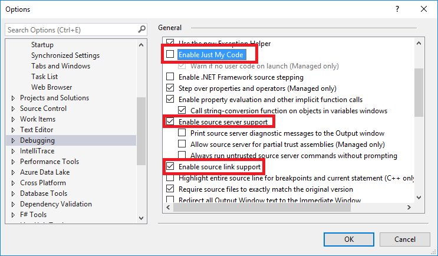

While it's not generally needed, you may want to step into ABP's source
code while you are debugging your project.

All official ASP.NET Boilerplate NuGet packages are
**[Sourcelink](https://github.com/ctaggart/SourceLink)** enabled. That
means you can easily debug **Abp.\*** NuGet packages within your
project. To enable it, change Visual Studio (2017+) Debugging options as
follows:

Once you enable it, you can step into (F11) the ASP.NET Boilerplate source
code.

 
