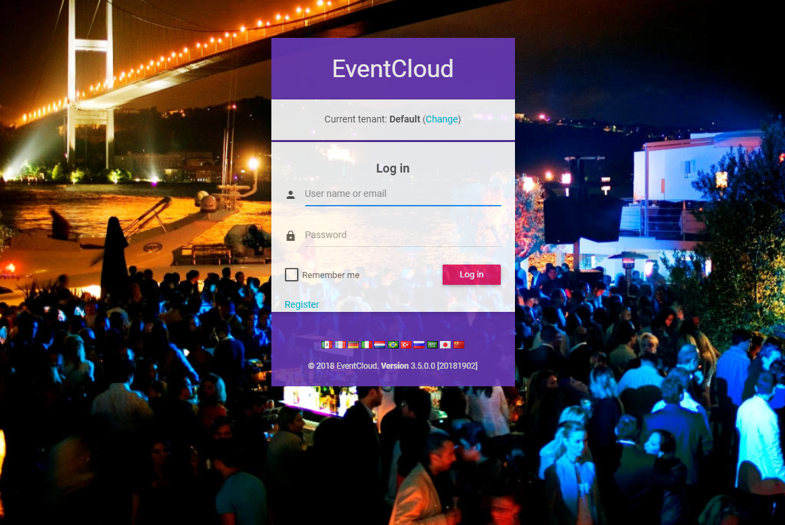

## Introduction

In this article, we will demonstrate a simple SaaS (multi-tenant) application developed using the following frameworks:

- ASP.NET Boilerplate as the application framework.
- ASP.NET Core and ASP.NET Web API as the Web Frameworks.
- Entity Framework Core as the ORM.
- Angular5 as the SPA framework.
- Bootstrap as the HTML/CSS framework.

## Creating Application From Template

ASP.NET Boilerplate provides templates to make a project's startup easier. The startup template can be created here: https://aspnetboilerplate.com/Templates

Select **ASP.NET Core 2.x**, **Angular** and check **"Include login, register, user, role and tenant management pages"**. A ready and working solution is then created, including a login page, navigation, and a bootstrap-based layout. After downloading and opening the solution with Visual Studio 2017+, you will see a layered solution structure including a unit test project.

### Solution structure

First, select **EventCloud.Host** as the startup project. The solution comes with **Entity Framework Core Code-First Migrations**, so after restoring the NuGet packages, open the Package Manager Console (PMC) and run the **Update-Database** command to create the database.

Package Manager Console's Default project should be **EventCloud.EntityFrameworkCore** (since it contains the migrations). This command creates the **EventCloud** database on the local SQL Server (you can change the connection string in the **appsettings.json** file).


First, run the **EventCloud.Host** project. You will see the following screen:


Use **Angular-CLI** to start **Angular UI**. Here are the steps to start Angular UI:

- Open cmd in the **EventCloud/angular** location
- Run the `yarn` command to install packages
- Run `npm start` to run the application

You will then see the following login page when browsing to http://localhost:4200 :



Enter **Default** as the tenancy name, **admin** as the user name and **123qwe** as the password to login.

After you login, you will see the basic bootstrap-based [Admin BSB Material Design](https://github.com/gurayyarar/AdminBSBMaterialDesign) layout.


This is a localized UI with a dynamic menu. The Angular layout, routing, and basic infrastructure are already set up. 
We got this project as a base for the event cloud project.

## Event Cloud Project

In this article, we will show the key parts of the project and explain it. So, please download the sample project, open it in **Visual Studio 2017+** and run the migrations just like above before reading the rest of the article (Be sure that there is no database named EventCloud before running the migrations!). We will follow some **DDD (Domain Driven Design)** techniques to create the domain (business) and application layers.

Event Cloud is a free SaaS (multi-tenant) application. We can create a tenant that has its own events, users, roles, etc. There are some simple business rules applied while creating, canceling and registering an event.

Let's check out the source code!

### Entities

Entities are part of our domain layer and are located in the **EventCloud.Core** project. The **ASP.NET Boilerplate** startup template comes with the **Tenant**, **User**, **Role**, and other entities which are common for most applications. We can customize them based on our needs. We can, of course, add our own application-specific entities.

The fundamental entity of the Event Cloud project is the `Event` entity.

```c#
[Table("AppEvents")]
public class Event : FullAuditedEntity<Guid>, IMustHaveTenant
{
    public const int MaxTitleLength = 128;
    public const int MaxDescriptionLength = 2048;

    public virtual int TenantId { get; set; }

    [Required]
    [StringLength(MaxTitleLength)]
    public virtual string Title { get; protected set; }

    [StringLength(MaxDescriptionLength)]
    public virtual string Description { get; protected set; }

    public virtual DateTime Date { get; protected set; }

    public virtual bool IsCancelled { get; protected set; }

    /// <summary>
    /// Gets or sets the maximum registration count.
    /// 0: Unlimited.
    /// </summary>
    [Range(0, int.MaxValue)]
    public virtual int MaxRegistrationCount { get; protected set; }

    [ForeignKey("EventId")]
    public virtual ICollection<EventRegistration> Registrations { get; protected set; }

    /// <summary>
    /// The constructor is not public in order to force you to create events using the <see cref="Create"/> method.
    /// However, the constructor can not be private since it's used by EntityFramework.
    /// That's why we made it protected.
    /// </summary>
    protected Event()
    {

    }

    public static Event Create(int tenantId, string title, DateTime date, string description = null, int maxRegistrationCount = 0)
    {
        var @event = new Event
        {
            Id = Guid.NewGuid(),
            TenantId = tenantId,
            Title = title,
            Description = description,
            MaxRegistrationCount = maxRegistrationCount
        };

        @event.SetDate(date);

        @event.Registrations = new Collection<EventRegistration>();

        return @event;
    }

    public bool IsInPast()
    {
        return Date < Clock.Now;
    }

    public bool IsAllowedCancellationTimeEnded()
    {
        return Date.Subtract(Clock.Now).TotalHours <= 2.0; //2 hours can be defined as an Event property and can be determined per event
    }

    public void ChangeDate(DateTime date)
    {
        if (date == Date)
        {
            return;
        }

        SetDate(date);

        DomainEvents.EventBus.Trigger(new EventDateChangedEvent(this));
    }

    internal void Cancel()
    {
        AssertNotInPast();
        IsCancelled = true;
    }

    private void SetDate(DateTime date)
    {
        AssertNotCancelled();

        if (date < Clock.Now)
        {
            throw new UserFriendlyException("Can not set an event's date in the past!");
        }

        if (date <= Clock.Now.AddHours(3)) //3 can be configurable per tenant
        {
            throw new UserFriendlyException("An event's date should be set at least 3 hours before it!");
        }

        Date = date;

        DomainEvents.EventBus.Trigger(new EventDateChangedEvent(this));
    }

    private void AssertNotInPast()
    {
        if (IsInPast())
        {
            throw new UserFriendlyException("This event was in the past");
        }
    }

    private void AssertNotCancelled()
    {
        if (IsCancelled)
        {
            throw new UserFriendlyException("This event is cancelled!");
        }
    }
}
```

The **Event** entity does more than just get and set properties. The properties do not have public setters, and are instead protected. An entity has some domain logic, and as such, all properties must be changed by the **Event** entity itself to ensure the domain logic is executed.

The **Event** entity's constructor is also protected, so the only way to create an Event is to use the `Event.Create` method. Constructors can normally be private, but private setters don't work well with Entity Framework Core, since Entity Framework Core can not set private properties when retrieving an entity from the database.

The Event implements the `IMustHaveTenant` interface. This is an interface included in the **ASP.NET Boilerplate (ABP)** framework and ensures that this entity is per-tenant. This is needed for multi-tenancy. Different tenants will have different events and can not see the other tenants' events. **ABP** automatically filters the entities of the current tenant.

The Event class inherits from the `FullAuditedEntity` class, which contains creation, modification and deletion audit columns. `FullAuditedEntity` also implements `ISoftDelete`, so events can not be deleted from the database. They are simply marked as deleted, instead of being actually deleted. **ABP** automatically filters (hides) deleted entities when you query the database.

In **DDD**, entities have domain (business) logic. We have some simple business rules that can be easily understood when you check the entity.

The second entity of our application is `EventRegistration`

```c#
[Table("AppEventRegistrations")]
public class EventRegistration : CreationAuditedEntity, IMustHaveTenant
{
    public int TenantId { get; set; }

    [ForeignKey("EventId")]
    public virtual Event Event { get; protected set; }
    public virtual Guid EventId { get; protected set; }

    [ForeignKey("UserId")]
    public virtual User User { get; protected set; }
    public virtual long UserId { get; protected set; }

    /// <summary>
    /// The constructor is not public in order to force you to create registrations using the <see cref="Create"/> method.
    /// However, the constructor can not be private since it's used by EntityFramework.
    /// That's why we made it protected.
    /// </summary>
    protected EventRegistration()
    {

    }

    public static async Task<EventRegistration> CreateAsync(Event @event, User user, IEventRegistrationPolicy registrationPolicy)
    {
        await registrationPolicy.CheckRegistrationAttemptAsync(@event, user);

        return new EventRegistration
        {
            TenantId = @event.TenantId,
            EventId = @event.Id,
            Event = @event,
            UserId = @user.Id,
            User = user
        };
    }

    public async Task CancelAsync(IRepository<EventRegistration> repository)
    {
        if (repository == null) { throw new ArgumentNullException("repository"); }

        if (Event.IsInPast())
        {
            throw new UserFriendlyException("Can not cancel event which is in the past!");
        }

        if (Event.IsAllowedCancellationTimeEnded())
        {
            throw new UserFriendlyException("It's too late to cancel your registration!");
        }

        await repository.DeleteAsync(this);
    }
}
```

Similar to `Event`, we have a static create method. The only way of creating a new EventRegistration is to use the `CreateAsync` method. It gets an event, user, and a registration policy and then checks if a given user can register to the event using the `registrationPolicy.CheckRegistrationAttemptAsync` method. This method throws an exception if a given user can not register to the given event. With such a design, we ensure that all the business rules are applied while creating a registration. There is no way of creating a registration without using a registration policy.

See the Entity documentation for more information on entities.

### Event Registration Policy

The `EventRegistrationPolicy` class is defined as shown below:

```c#
public class EventRegistrationPolicy : IEventRegistrationPolicy
{
    private readonly IRepository<EventRegistration> _eventRegistrationRepository;
    private readonly ISettingManager _settingManager;

    public EventRegistrationPolicy(
        IRepository<EventRegistration> eventRegistrationRepository,
        ISettingManager settingManager
        )
    {
        _eventRegistrationRepository = eventRegistrationRepository;
        _settingManager = settingManager;
    }

    public async Task CheckRegistrationAttemptAsync(Event @event, User user)
    {
        if (@event == null) { throw new ArgumentNullException("event"); }
        if (user == null) { throw new ArgumentNullException("user"); }

        CheckEventDate(@event);
        await CheckEventRegistrationFrequencyAsync(user);
    }

    private static void CheckEventDate(Event @event)
    {
        if (@event.IsInPast())
        {
            throw new UserFriendlyException("Can not register event in the past!");
        }
    }

    private async Task CheckEventRegistrationFrequencyAsync(User user)
    {
        var oneMonthAgo = Clock.Now.AddDays(-30);
        var maxAllowedEventRegistrationCountInLast30DaysPerUser = await _settingManager.GetSettingValueAsync<int>(AppSettingNames.MaxAllowedEventRegistrationCountInLast30DaysPerUser);
        if (maxAllowedEventRegistrationCountInLast30DaysPerUser > 0)
        {
            var registrationCountInLast30Days = await _eventRegistrationRepository.CountAsync(r => r.UserId == user.Id && r.CreationTime >= oneMonthAgo);
            if (registrationCountInLast30Days > maxAllowedEventRegistrationCountInLast30DaysPerUser)
            {
                throw new UserFriendlyException(string.Format("Can not register to more than {0}", maxAllowedEventRegistrationCountInLast30DaysPerUser));
            }
        }
    }
}
```

This is an important part of our domain. We have two rules while creating an event registration:

- A user can not register to an event in the past.
- A user can not register to a maximum count of events in 30 days. This way we can have a registration frequency limit.

### Event Manager

`EventManager` implements business (domain) logic for events. All Event operations should be executed using this class. It's defined as shown below:

```c#
public class EventManager : IEventManager
{
    public IEventBus EventBus { get; set; }

    private readonly IEventRegistrationPolicy _registrationPolicy;
    private readonly IRepository<EventRegistration> _eventRegistrationRepository;
    private readonly IRepository<Event, Guid> _eventRepository;

    public EventManager(
        IEventRegistrationPolicy registrationPolicy,
        IRepository<EventRegistration> eventRegistrationRepository,
        IRepository<Event, Guid> eventRepository)
    {
        _registrationPolicy = registrationPolicy;
        _eventRegistrationRepository = eventRegistrationRepository;
        _eventRepository = eventRepository;

        EventBus = NullEventBus.Instance;
    }

    public async Task<Event> GetAsync(Guid id)
    {
        var @event = await _eventRepository.FirstOrDefaultAsync(id);
        if (@event == null)
        {
            throw new UserFriendlyException("Could not found the event, maybe it's deleted!");
        }

        return @event;
    }

    public async Task CreateAsync(Event @event)
    {
        await _eventRepository.InsertAsync(@event);
    }

    public void Cancel(Event @event)
    {
        @event.Cancel();
        EventBus.Trigger(new EventCancelledEvent(@event));
    }

    public async Task<EventRegistration> RegisterAsync(Event @event, User user)
    {
        return await _eventRegistrationRepository.InsertAsync(
            await EventRegistration.CreateAsync(@event, user, _registrationPolicy)
            );
    }

    public async Task CancelRegistrationAsync(Event @event, User user)
    {
        var registration = await _eventRegistrationRepository.FirstOrDefaultAsync(r => r.EventId == @event.Id && r.UserId == user.Id);
        if (registration == null)
        {
            //No need to cancel since there is no such a registration
            return;
        }

        await registration.CancelAsync(_eventRegistrationRepository);
    }

    public async Task<IReadOnlyList<User>> GetRegisteredUsersAsync(Event @event)
    {
        return await _eventRegistrationRepository
            .GetAll()
            .Include(registration => registration.User)
            .Where(registration => registration.EventId == @event.Id)
            .Select(registration => registration.User)
            .ToListAsync();
    }
}
```

This performs domain logic and triggers needed events.

See the domain services documentation for more information.

### Domain Events

We may want to define and trigger some domain-specific events on some state changes in our application. We defined 2 domain-specific events:

- **EventCancelledEvent:** Triggered when an event is canceled. It's triggered in the `EventManager.Cancel` method.
- **EventDateChangedEvent:** Triggered when the date of an event has changed. It's triggered in the `Event.ChangeDate` method.

We handle these events and then notify related users about these changes. We also handle `EntityCreatedEventDate<Event>`, which is a pre-defined **ABP** event, and triggered automatically.

To handle an event, we must define an event handler class. Here we define `EventUserEmailer` to send emails to users, when needed:

```c#
public class EventUserEmailer :
        IEventHandler<EntityCreatedEventData<Event>>,
        IEventHandler<EventDateChangedEvent>,
        IEventHandler<EventCancelledEvent>,
        ITransientDependency
{
    public ILogger Logger { get; set; }

    private readonly IEventManager _eventManager;
    private readonly UserManager _userManager;

    public EventUserEmailer(
        UserManager userManager,
        IEventManager eventManager)
    {
        _userManager = userManager;
        _eventManager = eventManager;

        Logger = NullLogger.Instance;
    }

    [UnitOfWork]
    public virtual void HandleEvent(EntityCreatedEventData<Event> eventData)
    {
        //TODO: Send email to all tenant users as a notification

        var users = _userManager
            .Users
            .Where(u => u.TenantId == eventData.Entity.TenantId)
            .ToList();

        foreach (var user in users)
        {
            var message = string.Format("Hey! There is a new event '{0}' on {1}! Want to register?", eventData.Entity.Title, eventData.Entity.Date);
            Logger.Debug(string.Format("TODO: Send email to {0} -> {1}", user.EmailAddress, message));
        }
    }

    public void HandleEvent(EventDateChangedEvent eventData)
    {
        //TODO: Send email to all registered users!

        var registeredUsers = AsyncHelper.RunSync(() => _eventManager.GetRegisteredUsersAsync(eventData.Entity));
        foreach (var user in registeredUsers)
        {
            var message = eventData.Entity.Title + " event's date has changed! New date is: " + eventData.Entity.Date;
            Logger.Debug(string.Format("TODO: Send email to {0} -> {1}", user.EmailAddress, message));
        }
    }

    public void HandleEvent(EventCancelledEvent eventData)
    {
        //TODO: Send email to all registered users!

        var registeredUsers = AsyncHelper.RunSync(() => _eventManager.GetRegisteredUsersAsync(eventData.Entity));
        foreach (var user in registeredUsers)
        {
            var message = eventData.Entity.Title + " event is canceled!";
            Logger.Debug(string.Format("TODO: Send email to {0} -> {1}", user.EmailAddress, message));
        }
    }
}
```

We can handle the same events in different classes, or different events in the same class (as in this example). Here, we handle these events and send emails to the related users as a notification (Emailing is not actually implemented to make the sample application simpler). An event handler must implement the `IEventHandler<event-type>` interface. **ABP** automatically calls the handler when the related events occur.

See the **EventBus** documentation for more information on domain events.

### Application Services

Application services use the domain layer to implement the use-cases of the application (which are generally used by presentation layer). `EventAppService` performs application logic for events.

```c#
[AbpAuthorize]
public class EventAppService : EventCloudAppServiceBase, IEventAppService
{
    private readonly IEventManager _eventManager;
    private readonly IRepository<Event, Guid> _eventRepository;

    public EventAppService(
        IEventManager eventManager,
        IRepository<Event, Guid> eventRepository)
    {
        _eventManager = eventManager;
        _eventRepository = eventRepository;
    }

    public async Task<ListResultDto<EventListDto>> GetListAsync(GetEventListInput input)
    {
        var events = await _eventRepository
            .GetAll()
            .Include(e => e.Registrations)
            .WhereIf(!input.IncludeCanceledEvents, e => !e.IsCancelled)
            .OrderByDescending(e => e.CreationTime)
            .Take(64)
            .ToListAsync();

        return new ListResultDto<EventListDto>(events.MapTo<List<EventListDto>>());
    }

    public async Task<EventDetailOutput> GetDetailAsync(EntityDto<Guid> input)
    {
        var @event = await _eventRepository
            .GetAll()
            .Include(e => e.Registrations)
            .ThenInclude(r => r.User)
            .Where(e => e.Id == input.Id)
            .FirstOrDefaultAsync();

        if (@event == null)
        {
            throw new UserFriendlyException("Could not find the event, it may be deleted.");
        }

        return @event.MapTo<EventDetailOutput>();
    }

    public async Task CreateAsync(CreateEventInput input)
    {
        var @event = Event.Create(AbpSession.GetTenantId(), input.Title, input.Date, input.Description, input.MaxRegistrationCount);
        await _eventManager.CreateAsync(@event);
    }

    public async Task CancelAsync(EntityDto<Guid> input)
    {
        var @event = await _eventManager.GetAsync(input.Id);
        _eventManager.Cancel(@event);
    }

    public async Task<EventRegisterOutput> RegisterAsync(EntityDto<Guid> input)
    {
        var registration = await RegisterAndSaveAsync(
            await _eventManager.GetAsync(input.Id),
            await GetCurrentUserAsync()
            );

        return new EventRegisterOutput
        {
            RegistrationId = registration.Id
        };
    }

    public async Task CancelRegistrationAsync(EntityDto<Guid> input)
    {
        await _eventManager.CancelRegistrationAsync(
            await _eventManager.GetAsync(input.Id),
            await GetCurrentUserAsync()
            );
    }

    private async Task<EventRegistration> RegisterAndSaveAsync(Event @event, User user)
    {
        var registration = await _eventManager.RegisterAsync(@event, user);
        await CurrentUnitOfWork.SaveChangesAsync();
        return registration;
    }
}
```

As you can see, the application service does not implement the domain logic itself. It just uses entities and domain services (**EventManager**) to perform the use-cases.

See the application service documentation for more information.

### Presentation Layer

The presentation layer for this application is built using **Angular** as a SPA.

#### Event List

When we login to the application, we first see a list of events:


We directly use `EventAppService` to get a list of events. Here is the **events.component.ts** file to create this page:

```ts
import { Component, Injector, ViewChild } from '@angular/core';
import { appModuleAnimation } from '@shared/animations/routerTransition';
import { EventServiceProxy, EventListDto, ListResultDtoOfEventListDto, EntityDtoOfGuid } from '@shared/service-proxies/service-proxies';
import { PagedListingComponentBase, PagedRequestDto } from "shared/paged-listing-component-base";
import { CreateEventComponent } from "app/events/create-event/create-event.component";

@Component({
    templateUrl: './events.component.html',
    animations: [appModuleAnimation()]
})
export class EventsComponent extends PagedListingComponentBase<EventListDto> {

    @ViewChild('createEventModal') createEventModal: CreateEventComponent;

    active: boolean = false;
    events: EventListDto[] = [];
    includeCanceledEvents:boolean=false;

    constructor(
        injector: Injector,
        private _eventService: EventServiceProxy
    ) {
        super(injector);
    }

    protected list(request: PagedRequestDto, pageNumber: number, finishedCallback: Function): void {
        this.loadEvent();
        finishedCallback();
    }

    protected delete(event: EntityDtoOfGuid): void {
        abp.message.confirm(
            'Are you sure you want to cancel this event?',
            (result: boolean) => {
                if (result) {
                    this._eventService.cancelAsync(event)
                        .subscribe(() => {
                            abp.notify.info('Event is deleted');
                            this.refresh();
                        });
                }
            }
        );
    }

    includeCanceledEventsCheckboxChanged() {
        this.loadEvent();
    };

    // Show Modals
    createEvent(): void {
        this.createEventModal.show();
    }

    loadEvent() {
        this._eventService.getListAsync(this.includeCanceledEvents)
            .subscribe((result: ListResultDtoOfEventListDto) => {
                this.events = result.items;
            });
    }
}
```

We injected `EventServiceProxy` into the **events.component.ts** component. We used the dynamic web api layer feature of **ABP**. It creates the needed Web API controller and Angular services automatically and dynamically. We can then use the application service methods like calling regular typescript functions. To call the `EventAppService.GetListAsync` C# method, we simply call the `_eventService.getListAsync` typescript function.

We also open a "new event" modal (dialog) when a user clicks the "+ New event" button, which triggers the `createEvent` function. We will not go into the details of Angular views, since they are simple and can be looked up in the source code.

#### Event Detail

When we click the "Details" button for an event, we go to the event details with an URL like [http://eventcloud.aspnetboilerplate.com/#/events/e9499e3e-35c0-492c-98ce-7e410461103f](http://eventcloud.aspnetboilerplate.com/#/events/e9499e3e-35c0-492c-98ce-7e410461103f) . A GUID is the id of the event.


Here, we see event details with registered users. We can register to the event or cancel the registration. This view's component is defined in **event-detail.component.ts**, as shown below:

```ts
import { Component, OnInit, Injector } from '@angular/core';
import { appModuleAnimation } from '@shared/animations/routerTransition';
import { ActivatedRoute, Params, Router } from '@angular/router';
import { AppComponentBase } from '@shared/app-component-base';
import { EventDetailOutput, EventServiceProxy, EntityDtoOfGuid, EventRegisterOutput } from '@shared/service-proxies/service-proxies';

import * as _ from 'lodash';

@Component({
    templateUrl: './event-detail.component.html',
    animations: [appModuleAnimation()]
})

export class EventDetailComponent extends AppComponentBase implements OnInit {

    event: EventDetailOutput = new EventDetailOutput();
    eventId:string;

    constructor(
        injector: Injector,
        private _eventService: EventServiceProxy,
        private _router: Router,
        private _activatedRoute: ActivatedRoute
    ) {
        super(injector);
    }

    ngOnInit(): void {
        this._activatedRoute.params.subscribe((params: Params) => {
            this.eventId = params['eventId'];
            this.loadEvent();
        });
    }

    registerToEvent(): void {
        var input = new EntityDtoOfGuid();
        input.id = this.event.id;

        this._eventService.registerAsync(input)
            .subscribe((result: EventRegisterOutput) => {
                abp.notify.success('Successfully registered to event. Your registration id: ' + result.registrationId + ".");
                this.loadEvent();
            });
    };

    cancelRegistrationFromEvent(): void {
        var input = new EntityDtoOfGuid();
        input.id = this.event.id;

        this._eventService.cancelRegistrationAsync(input)
            .subscribe(() => {
                abp.notify.info('Canceled your registration.');
                this.loadEvent();
            });
    };

    cancelEvent(): void {
        var input = new EntityDtoOfGuid();
        input.id = this.event.id;

        this._eventService.cancelAsync(input)
            .subscribe(() => {
                abp.notify.info('Canceled the event.');
                this.backToEventsPage();
            });
    };

    isRegistered(): boolean {
        return _.some(this.event.registrations, { userId: abp.session.userId });
    };

    isEventCreator(): boolean {
        return this.event.creatorUserId === abp.session.userId;
    };

    loadEvent() {
        this._eventService.getDetailAsync(this.eventId)
            .subscribe((result: EventDetailOutput) => {
                this.event = result;
            });
    }

    backToEventsPage() {
        this._router.navigate(['app/events']);
    };
}
```

We can simply use the event application service to perform actions.

#### Main Menu

The top menu is automatically created by the **ABP template**. We can define the menu items in the `sidebar-nav.component.ts` class:

```ts
@Component({
    templateUrl: './sidebar-nav.component.html',
    selector: 'sidebar-nav',
    encapsulation: ViewEncapsulation.None
})
export class SideBarNavComponent extends AppComponentBase {

    menuItems: MenuItem[] = [
        new MenuItem(this.l("HomePage"), "", "home", "/app/home"),

        new MenuItem(this.l("Tenants"), "Pages.Tenants", "business", "/app/tenants"),
        new MenuItem(this.l("Users"), "Pages.Users", "people", "/app/users"),
        new MenuItem(this.l("Roles"), "Pages.Roles", "local_offer", "/app/roles"),
        new MenuItem(this.l("Events"), "Pages.Events", "event", "/app/events"),
        new MenuItem(this.l("About"), "", "info", "/app/about"),
        
...        
```

#### Angular Route

Defining the menu only shows it on the page. Angular has it's own route system. Routes are defined in the app-routing-module.ts file as shown below:

```ts
import { NgModule } from '@angular/core';
import { RouterModule } from '@angular/router';
import { AppComponent } from './app.component';
import { AppRouteGuard } from '@shared/auth/auth-route-guard';
import { HomeComponent } from './home/home.component';
import { AboutComponent } from './about/about.component';
import { UsersComponent } from './users/users.component';
import { TenantsComponent } from './tenants/tenants.component';
import { RolesComponent } from "app/roles/roles.component";
import { EventsComponent } from "app/events/events.component";
import { EventDetailComponent } from "app/events/event-detail/event-detail.component";

@NgModule({
    imports: [
        RouterModule.forChild([
            {
                path: '',
                component: AppComponent,
                children: [
                    { path: 'home', component: HomeComponent, canActivate: [AppRouteGuard] },
                    { path: 'users', component: UsersComponent, data: { permission: 'Pages.Users' }, canActivate: [AppRouteGuard] },
                    { path: 'roles', component: RolesComponent, data: { permission: 'Pages.Roles' }, canActivate: [AppRouteGuard] },
                    { path: 'tenants', component: TenantsComponent, data: { permission: 'Pages.Tenants' }, canActivate: [AppRouteGuard] },
                    { path: 'events', component: EventsComponent, data: { permission: 'Pages.Events' }, canActivate: [AppRouteGuard] },
                    { path: 'events/:eventId', component: EventDetailComponent },
                    { path: 'about', component: AboutComponent }
                ]
            }
        ])
    ],
    exports: [RouterModule]
})
export class AppRoutingModule { }

```

### Unit and Integration Tests

**ASP.NET Boilerplate** provides some tools to make unit and integration tests easier. You can find all the test code in the source code of the project. Here, we will briefly explain some basic tests. The solution includes the `EventAppService_Tests` class, which tests the `EventAppService`. Here are 2 tests from this class:

```c#
public class EventAppService_Tests : EventCloudTestBase
{
    private readonly IEventAppService _eventAppService;

    public EventAppService_Tests()
    {
        _eventAppService = Resolve<IEventAppService>();
    }

    [Fact]
    public async Task Should_Get_Test_Events()
    {
        var output = await _eventAppService.GetListAsync(new GetEventListInput());
        output.Items.Count.ShouldBe(1);
    }

    [Fact]
    public async Task Should_Create_Event()
    {
        //Arrange
        var eventTitle = Guid.NewGuid().ToString();

        //Act
        await _eventAppService.CreateAsync(new CreateEventInput
        {
            Title = eventTitle,
            Description = "A description",
            Date = Clock.Now.AddDays(2)
        });

        //Assert
        UsingDbContext(context =>
        {
            context.Events.FirstOrDefault(e => e.Title == eventTitle).ShouldNotBe(null);
        });
    }

    [Fact]
    public async Task Should_Not_Create_Events_In_The_Past()
    {
        //Arrange
        var eventTitle = Guid.NewGuid().ToString();

        //Act
        await Assert.ThrowsAsync<UserFriendlyException>(async () =>
        {
            await _eventAppService.CreateAsync(new CreateEventInput
            {
                Title = eventTitle,
                Description = "A description",
                Date = Clock.Now.AddDays(-1)
            });
        });
    }

    [Fact]
    public async Task Should_Cancel_Event()
    {
        //Act
        await _eventAppService.CancelAsync(new EntityDto<Guid>(GetTestEvent().Id));

        //Assert
        GetTestEvent().IsCancelled.ShouldBeTrue();
    }

    [Fact]
    public async Task Should_Register_To_Events()
    {
        //Arrange
        var testEvent = GetTestEvent();

        //Act
        var output = await _eventAppService.RegisterAsync(new EntityDto<Guid>(testEvent.Id));

        //Assert
        output.RegistrationId.ShouldBeGreaterThan(0);

        UsingDbContext(context =>
        {
            var currentUserId = AbpSession.GetUserId();
            var registration = context.EventRegistrations.FirstOrDefault(r => r.EventId == testEvent.Id && r.UserId == currentUserId);
            registration.ShouldNotBeNull();
        });
    }

    [Fact]
    public async Task Should_Cancel_Registration()
    {
        //Arrange
        var currentUserId = AbpSession.GetUserId();
        await UsingDbContext(async context =>
        {
            var testEvent = GetTestEvent(context);
            var currentUser = await context.Users.SingleAsync(u => u.Id == currentUserId);
            var testRegistration = await EventRegistration.CreateAsync(
                testEvent,
                currentUser,
                Substitute.For<IEventRegistrationPolicy>()
                );

            context.EventRegistrations.Add(testRegistration);
        });

        //Act
        await _eventAppService.CancelRegistrationAsync(new EntityDto<Guid>(GetTestEvent().Id));

        //Assert
        UsingDbContext(context =>
        {
            var testEvent = GetTestEvent(context);
            var testRegistration = context.EventRegistrations.FirstOrDefault(r => r.EventId == testEvent.Id && r.UserId == currentUserId);
            testRegistration.ShouldBeNull();
        });
    }

    private Event GetTestEvent()
    {
        return UsingDbContext(context => GetTestEvent(context));
    }

    private static Event GetTestEvent(EventCloudDbContext context)
    {
        return context.Events.Single(e => e.Title == TestDataBuilder.TestEventTitle);
    }
}
```

We use xUnit as the test framework. In the first test, we simply create an event and check the database if it's in there. In the second test, we intentionally try to create an event in the past. Since our business rule doesn't allow it, we should get an exception here.

With these tests, we tested everyting starting from the application service, including all aspects of **ASP.NET Boilerplate** (like validation, unit of work and so on). 

### Token-Based Authentication

If you want to consume the APIs/application services from a mobile application, you can use the token-based authentication mechanism just like we do for the Angular client. The startup template includes the JwtBearer token authentication infrastructure.

We will use Postman (a chrome extension) to demonstrate requests and responses.

#### Authentication

Just send a POST request to http://localhost:21021/api/TokenAuth/Authenticate with the **Context-Type="application/json"** header as shown below:


We sent a JSON request body which includes the tenancyName, userNameOrEmailAddress and password. tenancyName is not required for host users. As seen above, the result property of the returning JSON contains the token. We can save it and use it for the next requests.


#### Using the API

After we authenticate and get the **token**, we can use it to call any **authorized** action. All **application services** can be used remotely. For example, we can use the **User service** to get a **list of users**:


We simply made a **GET** request to **http://localhost:21021/api/services/app/user/getAll** with **Content-Type="application/json"** and **Authorization="Bearer *your-******auth-token*** **"**. All the functionality available on the UI are also available as an API.

Almost all operations available on the UI are also available as a Web API (since UI uses the same Web API), and can be consumed easily.

### Source Code

You can get the latest source code here: [Event Cloud Source](https://github.com/aspnetboilerplate/eventcloudcore)
