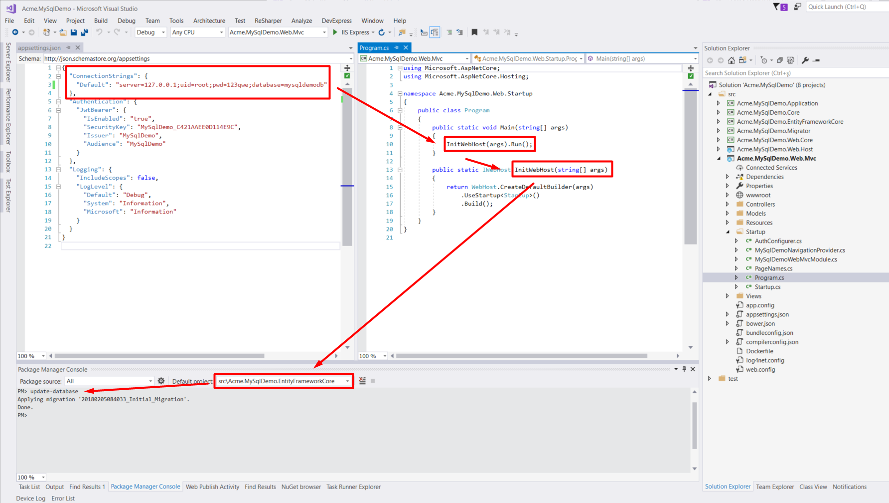

### Download Starter Template

I will use a starter template with **ASP.NET Core** and **Entity Framework Core** to integrate MySql. 
So I downloaded a multi-page template with **ASP.NET Core 2.x** + **.Net Core Framework** + **Authentication** from [https://aspnetboilerplate.com/Templates](https://aspnetboilerplate.com/Templates)

### Getting Started

There are two Entity Framework Core providers for MySql that are mentioned in Micrososft Docs. One of them is 
[Official MySQL EF Core Database Provider](https://docs.microsoft.com/en-us/ef/core/providers/mysql/) and 
other is [Pomelo EF Core Database Provider for MySQL](https://docs.microsoft.com/en-us/ef/core/providers/pomelo/).

> **NOTE:** Official provider doesn't support EF Core 2.0 yet. So we will use Pomelo.
> 
> Related issue: https://github.com/aspnet/EntityFrameworkCore/issues/10065#issuecomment-336495475

### Install 

Install [`Pomelo.EntityFrameworkCore.MySql`](https://www.nuget.org/packages/Pomelo.EntityFrameworkCore.MySql/) nuget package to ***.EntityFrameworkCore** project. 

### Configuration

We need some configurations and workarounds to use MySql with ASP.NET Core and Entity Framework Core. 
There is no need to add any configuration for ABP.

#### Configure connection string 

Change connection string to your MySql connection in ***.Web.Mvc/appsettings.json**. For example:

```js
{
  "ConnectionStrings": {
    "Default": "server=127.0.0.1;uid=root;pwd=1234;database=mysqldemodb"
  },
  ...
}

```

#### A workaround

To prevent EF Core from calling `Program.BuildWebHost()` rename `BuildWebHost`. For example, I will change it to `InitWebHost`. 
I won't be detailed this workaround. I will give some points to understand better. Check the following issues,

> **Reason** : [EF Core 2.0: design-time DbContext discovery changes](https://github.com/aspnet/EntityFrameworkCore/issues/9033)
> 
> **Workaround** : [Design: Allow IDesignTimeDbContextFactory to short-circuit service provider creation](https://github.com/aspnet/EntityFrameworkCore/issues/9076#issuecomment-313278753)
>
> **NOTE :** If you don't rename `BuildWebHost`, you get an error like `Unknown database 'your_database'` in MySQL, 
but your database will be created succesfully.

### Create Database

We are ready to create database and run project. 

- Select __\*.Web.Mvc__ as startup project.
- Open **Package Manager Console** and select __\*.EntityFrameworkCore__ project.
- Run `update-database` command

MySql integration is completed. Now you can run your project with MySql. 

### Summary

Below image shows all the steps about integrating MySql.



