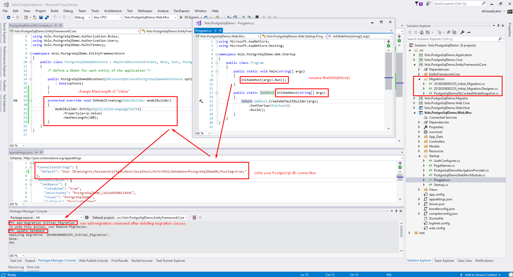

### Download Starter Template

I will use a starter template with **ASP.NET Core** and **Entity Framework Core** to integrate PostgreSql. 
So I downloaded a multi-page template with **ASP.NET Core 2.x** + **.Net Core Framework** + **Authentication** from [https://aspnetboilerplate.com/Templates](https://aspnetboilerplate.com/Templates)

### Install 

Install [`Npgsql.EntityFrameworkCore.PostgreSQL`](https://www.nuget.org/packages/Npgsql.EntityFrameworkCore.PostgreSQL/) nuget package to ***.EntityFrameworkCore** project. 

### Configuration

We need some configurations and workarounds to use PostgreSql with ASP.NET Core and Entity Framework Core. 

#### Configure DbContext 

Replace `YourProjectNameDbContextConfigurer.cs` with the following lines

```c#
public static class SqliteDemoDbContextConfigurer
{
    public static void Configure(DbContextOptionsBuilder<PostgreSqlDemoDbContext> builder, string connectionString)
    {
        builder.UseNpgsql(connectionString);
    }

    public static void Configure(DbContextOptionsBuilder<PostgreSqlDemoDbContext> builder, DbConnection connection)
    {
        builder.UseNpgsql(connection);
    }
 }
 ```

#### Configure connection string 

Change connection string to your PostgreSql connection in ***.Web.Mvc/appsettings.json**. For example:

```js
{
  "ConnectionStrings": {
    "Default": "User ID=postgres;Password=123;Host=localhost;Port=5432;Database=PostgreSqlDemoDb;Pooling=true;"
  },
  ...
}

```

#### A workaround

To prevent EF Core from calling `Program.BuildWebHost()` rename `BuildWebHost`. For example, I will change it to `InitWebHost`. 
I won't be detailed this workaround. I will give some points to understand better. Check the following issues,

> **Reason** : [EF Core 2.0: design-time DbContext discovery changes](https://github.com/aspnet/EntityFrameworkCore/issues/9033)
> 
> **Workaround** : [Design: Allow IDesignTimeDbContextFactory to short-circuit service provider creation](https://github.com/aspnet/EntityFrameworkCore/issues/9076#issuecomment-313278753)
>
> **NOTE :** If you don't rename `BuildWebHost`, you get an error that is about running `BuildWebHost` method.

### Create Database

Before you create the database, you should change max length of "Value" property of AbpLanguagesTexts with adding following lines to DbContext.
Because max length of char in MS Sql and PostgreSql are different.

```c#
public class PostgreSqlDemoDbContext : AbpZeroDbContext<Tenant, Role, User, PostgreSqlDemoDbContext>
{
    public PostgreSqlDemoDbContext(DbContextOptions<PostgreSqlDemoDbContext> options)
        : base(options)
    {
    }

    // add these lines to override max length of property
    // we should set max length smaller than that postgresql allowed size (10485760)
    protected override void OnModelCreating(ModelBuilder modelBuilder)
    {
        modelBuilder.Entity<ApplicationLanguageText>()
            .Property(p=>p.Value)
            .HasMaxLength(100); // any integer that is smaller than 10485760
    }
}
```

Then remove all migration classes under ***.EntityFrameworkCore/Migrations** folder. 
Because `Npgsql.EntityFrameworkCore.PostgreSQL` will add some of its own configurations to work with Entity Framework Core.

Now we are ready to create database and run project. 

- Select **\*.Web.Mvc** as startup project.
- Open **Package Manager Console** and select **\*.EntityFrameworkCore** project.
- Run `add-migration Initial_Migration` command
- Run `update-database` command

PostgreSql integration is completed. Now you can run your project with PostgreSql. 

### Summary

Below image shows all the steps about integrating PostgreSql.


