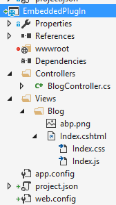
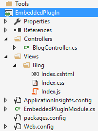
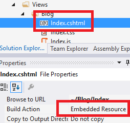

### Introduction

ASP.NET Boilerplate provides an easy way of using embedded **Razor
views** (.cshtml files) and **other resources** (css, js, img... files)
in your web application. You can use this feature to create
[plugins/modules](Module-System.md) that contain UI functionality.

### Create the Embedded Files

First, we create a file and mark it as an **embedded resource**. Any
assembly can contain embedded resource files. The process changes based
on your project format.

#### xproj/project.json Format

Assume that we have a project named EmbeddedPlugIn, as shown below:

To make **all files** under the **Views** folder embedded resources, we 
add the following configuration to **project.json**:

      "buildOptions": {
        "embed": {
          "include": [
            "Views/**/*.*"
          ]
        }
      }

#### csproj Format

Assume that we have a project named EmbeddedPlugIn, as shown below:

Select the **Index.cshtml** file, go to the properties window (shorcut is F4)
and change it's **Build Action** to **Embedded Resource**.

You should change the build action to **embedded resource** for **all** the
files you want to use in a web application.

### Add To Embedded Resource Manager

Once we embed our files into the assembly, we can use the [startup
configuration](Startup-Configuration.md) to add them to the embedded
resource manager. You can add a line like this to the PreInitialize method of
your [module](Module-System.md):

    Configuration.EmbeddedResources.Sources.Add(
        new EmbeddedResourceSet(
            "/Views/",
            Assembly.GetExecutingAssembly(),
            "EmbeddedPlugIn.Views"
        )
    );

Let's explain the parameters:

-   The first parameter defines the **root folder** for the files (like
    http://yourdomain.com**/Views/**, here). It matches to the root
    namespace.
-   The second parameter defines the **Assembly** containing the files. This code
    should be located in the assembly containing the embedded files.
    Otherwise, you should change this parameter accordingly.
-   The last parameter defines the **root namespace** of the files in the
    assembly. This is the default namespace (generally, the assembly
    name) plus the 'folders in the assembly' joined by a dot.

### Consume Embedded Views

For **.cshtml** files, it's straightforward to return them from a
Controller Action. BlogController in the EmbeddedPlugIn assembly is
shown below:

    using Abp.AspNetCore.Mvc.Controllers;
    using Microsoft.AspNetCore.Mvc;

    namespace EmbeddedPlugIn.Controllers
    {
        public class BlogController : AbpController
        {
            public ActionResult Index()
            {
                return View();
            }
        }
    }

As you can see, it's the same as regular controllers and works just as expected.

### Consume Embedded Resources

To consume embedded resources (js, css, img...), we can use them in
our views like we normally do:

    @section Styles {
        <link href="~/Views/Blog/Index.css" rel="stylesheet" />
    }

    @section Scripts
    {
        
    }

    <h2 id="BlogTitle">Blog plugin!</h2>

It assumes that the main application has the Styles and Scripts sections. We
can also use other files, like images, like we normally do.

#### ASP.NET Core Configuration

ASP.NET MVC 5.x projects will automatically integrate to the embedded
resource manager through Owin (if your startup file contains
app.UseAbp() as expected). For ASP.NET Core projects, we have to manually
add **app.UseEmbeddedFiles()** to the Startup class, just after
app.UseStaticFiles(), as shown below:

    app.UseStaticFiles();
    app.UseEmbeddedFiles(); //Allows to expose embedded files to the web!

#### Ignored Files

Normally, **all files** in the embedded resource manager can be directly
consumed by clients as if they were static files. You can ignore some
file extensions for security and other purposes. **.cshtml** and
**.config** files are ignored by default (for direct requests from
clients). You can add more extensions in the PreInitialize method of your 
module as shown below:

    Configuration.Modules.AbpWebCommon().EmbeddedResources.IgnoredFileExtensions.Add("exe");

### Override Embedded Files

One important feature of embedded resource files is that **they can be
overridden** by higher modules. This means you can create a file with the
same name in the same folder in your web application to override an
embedded file (your file in the web application does not require it to be
an embedded resource, because static files have priority over embedded
files). Thus, you can override the css, js or view files of your
modules/plugins in the application. If module A depends on module
B and module A defines an embedded resource with the same path, it will
override the embedded resource file of module B.

Note: For ASP.NET Core projects, you should put the overriding files
in the wwwroot folder as the root path.
