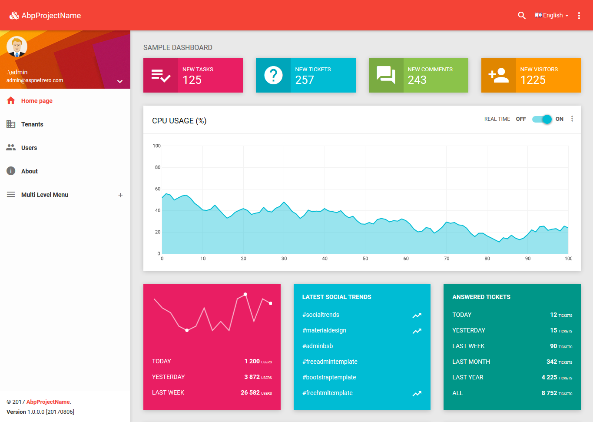

### What is the ASP.NET Boilerplate?

ASP.NET Boilerplate (**ABP**) is an **[open source](https://github.com/aspnetboilerplate/aspnetboilerplate)** and well-documented **application framework**.
It's not just a framework, it also provides a strong **[architectural model](https://aspnetboilerplate.com/Pages/Documents/NLayer-Architecture)**
based on **Domain Driven Design**, with all the **best practices** in mind.

ABP works with the latest **ASP.NET Core** & **EF Core** but also supports ASP.NET MVC 5.x & EF 6.x as well.

### A Quick Sample

Let's investigate a simple class to see ABP's benefits:

    public class TaskAppService : ApplicationService, ITaskAppService
    {
        private readonly IRepository<Task> _taskRepository;

        public TaskAppService(IRepository<Task> taskRepository)
        {
            _taskRepository = taskRepository;
        }

        [AbpAuthorize(MyPermissions.UpdateTasks)]
        public async Task UpdateTask(UpdateTaskInput input)
        {
            Logger.Info("Updating a task for input: " + input);

            var task = await _taskRepository.FirstOrDefaultAsync(input.TaskId);
            if (task == null)
            {
                throw new UserFriendlyException(L("CouldNotFindTheTaskMessage"));
            }

            ObjectMapper.MapTo(input, task);
        }
    }

Here we see a sample [Application Service](Application-Services.md) method. An application service, in DDD,
is directly used by the presentation layer to perform the **use cases** of the application.
Think **UpdateTask** as a method that is called by JavaScript via AJAX.

Let's see some of ABP's benefits here:

-   **[Dependency Injection](/Pages/Documents/Dependency-Injection)**: ABP uses and provides a conventional DI infrastructure.
    Since this class is an application service, it's conventionally
    registered to the DI container as transient (created per request). It
    can simply inject any dependencies (such as the IRepository&lt;Task&gt; in
    this sample).
-   **[Repository](/Pages/Documents/Repositories)**: ABP can create a default repository for each entity (such as IRepository&lt;Task&gt; in
    this example). The default repository has many useful methods such as the
    FirstOrDefault method used in this example. We can extend the default
    repository to suit our needs. Repositories abstract the DBMS and ORMs and
    simplify the data access logic.
-   **[Authorization](/Pages/Documents/Authorization)**: ABP can check permissions declaratively.
    It prevents access to the UpdateTask method if the current user
    has no "update tasks" permission or is not logged in. ABP not only uses declarative
    attributes, but it also has additional ways in which you can authorize.
-   **[Validation](/Pages/Documents/Validating-Data-Transfer-Objects)**: ABP automatically checks if the input is null. It also validates all
    the properties of an input based on standard data annotation attributes
    and custom validation rules. If a request is not valid, it throws a
    proper validation exception and handles it in the client side.
-   **[Audit Logging](/Pages/Documents/Audit-Logging)** : User, browser, IP address, calling service, method, parameters, calling time,
    execution duration and some other information is automatically
    saved for each request based on conventions and configurations.
-   [**Unit Of Work**](/Pages/Documents/Unit-Of-Work): In ABP, each application service method is assumed to be a unit of work by default.
    It automatically creates a connection and begins a transaction at
    the beginning of the method. If the method successfully completes
    without an exception, then the transaction is committed and the connection
    is disposed. Even if this method uses different repositories or
    methods, all of them will be atomic (transactional). All changes
    on entities are automatically saved when a transaction is committed.
    We don't even need to call the \_repository.Update(task) method as
    shown above.
-   [**Exception Handling**](/Pages/Documents/Handling-Exceptions): We almost never have to manually handle exceptions in ABP on a web application. All exceptions are automatically handled by default! If an exception
    occurs, ABP automatically logs it and returns a proper result to the
    client. For example, if this is an AJAX request, it returns a
    JSON object to the client indicating that an error occurred. It hides the actual
    exception from the client unless the exception is a
    UserFriendlyException, as used in this sample. It also understands
    and handles errors on the client side and show appropriate messages to the
    users.
-   **[Logging](/Pages/Documents/Logging)**: As you see, we can write logs using the Logger object defined in the base class.
    Log4Net is used by default, but it's changeable and configurable.
-   **[Localization](/Pages/Documents/Localization)**: Note that we used the 'L' method while throwing the exception?
    This way, it's automatically localized based on the current user's culture. See the [localization](/Pages/Documents/Localization) document for more.
-   **[Auto Mapping](/Pages/Documents/Data-Transfer-Objects)**: In the last line, we map input using the MapTo method of ABP's IObjectMapper.
    properties to entity properties. It uses the AutoMapper library to
    perform the mapping. We can easily map properties from one object
    to another based on naming conventions.
-   **[Dynamic API Layer](/Pages/Documents/Dynamic-Web-API)**: TaskAppService is a simple class, actually. We generally have to write a wrapper API Controller to expose methods to JavaScript clients, but ABP
    automatically does that on runtime. This way, we can use application
    service methods directly from clients.
-   **[Dynamic JavaScript AJAX Proxy](/Pages/Documents/Dynamic-Web-API#dynamic-javascript-proxies)** : ABP creates proxy methods that make calling application
    service methods as simple as calling JavaScript methods on the client.

We can see the benefits of ABP in this simple class. All these tasks normally take significant time,
but are automatically handled by the framework.

Besides this simple example, ABP provides a strong infrastructure and development model for
[modularity](/Pages/Documents/Module-System), [multi-tenancy](Multi-Tenancy.md), [caching](Caching.md), [background jobs](Background-Jobs-And-Workers.md), [data filters](/Pages/Documents/Data-Filters), [setting management](/Pages/Documents/Setting-Management), [domain events](EventBus-Domain-Events.md), unit & integration testing and so on... You focus on your business code and don't repeat yourself!

### Getting Started

You can start with the startup templates or the introduction tutorials.

#### Startup Templates

Directly create a modern looking startup project from the [startup templates](/Templates).

Startup templates provides a basic layout and some common features for an application. There are several startup templates with different options.

##### ASP.NET Core

* [Single Page Application with ASP.NET Core & Angular](Zero/Startup-Template-Angular.md)
* [Multi-Page Application with ASP.NET Core & jQuery](Zero/Startup-Template-Core.md)

##### ASP.NET MVC 5.x

* [ASP.NET MVC 5.x & AngularJS 1.x / ASP.NET MVC 5.x & jQuery](Zero/Startup-Template.md)

See the [download page](/Templates) for other combinations.

#### Introduction Tutorials

Step by step tutorials introduces the framework and explains how to create your application based on the startup templates.

##### ASP.NET Core

-   [Introduction with ASP.NET Core & Entity Framework Core](Articles/Introduction-With-AspNet-Core-And-Entity-Framework-Core-Part-1/index.html)
-   [Developing a multi-tenant (SaaS) application with ASP.NET Core, EntityFramework Core & Angular](Articles/Developing-MultiTenant-SaaS-ASP.NET-CORE-Angular/index.html)

##### ASP.NET MVC 5.x

-   [Introduction with ASP.NET MVC 5.x, Web API 2.x, EntityFramework 6.x & AngularJS 1.x](Articles/Introduction-With-AspNet-MVC-Web-API-EntityFramework-and-AngularJs/index.html)
-   [Developing a multi-tenant (SaaS) application with ASP.NET MVC 5.x, EntityFramework 6.x & AngularJS 1.x](Articles/Developing-a-Multi-Tenant-SaaS-Application-with-ASP.NET-MVC-EntityFramework-AngularJs/index.html)

### Samples

There are many sample projects developed with the framework. See [the samples page](/Samples).

### Community

This is an open source project and open to contributions from the community.

* Use [the GitHub repository](https://github.com/aspnetboilerplate/aspnetboilerplate) to access the latest **source code**, create [issues](https://github.com/aspnetboilerplate/aspnetboilerplate/issues) and send [pull requests](https://github.com/aspnetboilerplate/aspnetboilerplate/pulls).
* Use [aspnetboilerplate tag on stackoverflow](https://stackoverflow.com/questions/tagged/aspnetboilerplate) to ask questions about the usage.
* Follow [aspboilerplate on twitter](https://twitter.com/aspboilerplate) to be informed about the happenings.
