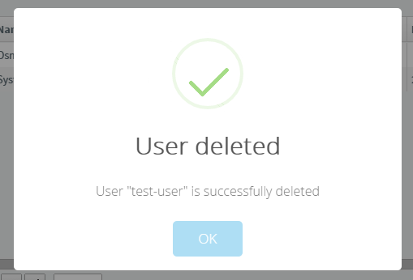
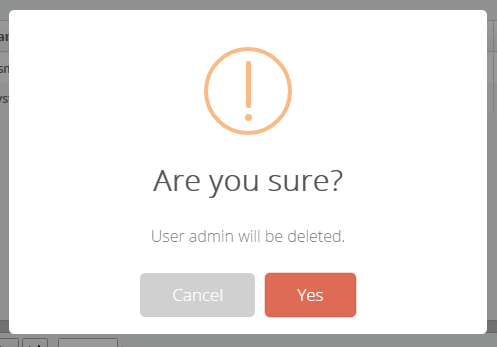

The Message API is used to show a message to the user or to get a
confirmation from the user.

By default, the Message API is implemented using
[sweetalert](http://t4t5.github.io/sweetalert/). To make
sweetalert work, you should include its CSS & JavaScript files, then
include **abp.sweet-alert.js** to your page.

### Show message

Examples:

    abp.message.info('some info message', 'some optional title');
    abp.message.success('some success message', 'some optional title');
    abp.message.warn('some warning message', 'some optional title');
    abp.message.error('some error message', 'some optional title');

A success message is shown below:

### Confirmation

Example:

    abp.message.confirm(
        'User admin will be deleted.',
        'Are you sure?',
        function (isConfirmed) {
            if (isConfirmed) {
                //...delete user
            }
        }
    );

The second argument (title) is optional here, so the callback function can be the
second argument instead.

A confirmation message is shown below:

ASP.NET Boilerplate internally uses the Message API. For example, it calls
abp.message.error if an [AJAX](/Pages/Documents/Javascript-API/AJAX)
call fails.
