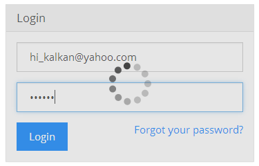

ASP.NET Boilerplate provides some useful APIs to make all or some parts of the
page blocked and/or busy (with a busy indicator).

### UI Block API

This API is used to block a whole page or an element on a page with a
transparent overlay. This way, the user can not click it. It's pretty useful
when saving a form or loading an area (a div or even complete page).
Examples:

    abp.ui.block(); //Block the whole page
    abp.ui.block($('#MyDivElement')); //You can use any jQuery selection..
    abp.ui.block('#MyDivElement'); //..or a direct selector
    abp.ui.unblock(); //Unblock the page
    abp.ui.unblock('#MyDivElement'); //Unblock specific element

The UI Block API is implemented using the
[blockUI](http://malsup.com/jquery/block/) jQuery plug-in by default. To
make it work, you must include it's JavaScript file, then include
**abp.blockUI.js** to your page as the adapter (See this JavaScript file for the
simple implementation and defaults).

### UI Busy API

This API is used to make a page/element busy. For example, you may
want to block a form and show a busy indicator while submitting the form
to the server. Examples:

    abp.ui.setBusy('#MyLoginForm');
    abp.ui.clearBusy('#MyLoginForm');

Example screenshot:

The parameter should be a jQuery selector (like '\#MyLoginForm') or a
jQuery selection (like $('\#MyLoginForm')). To make the whole page busy,
you can pass null (or 'body') as the selector.

The setBusy function can take a promise as second parameter and then
automatically unblock the page/element when the promise is completed. Example:

    abp.ui.setBusy(
        $('#MyLoginForm'), 
        abp.ajax({ ... })   
    );

Since [abp.ajax](/Pages/Documents/Javascript-API/AJAX) returns a promise,
we can directly pass it as a promise. To learn more about promises, see
jQuery's [Deferred Object](http://api.jquery.com/category/deferred-object/) documentation.
The setBusy method also supports Q (and Angular's $http service).

The UI Busy API is implemented using
[spin.js](http://fgnass.github.io/spin.js/). To make it work, you must
include its JavaScript file, then include **abp.spin.js** to your page
(See this JavaScript file for the simple implementation and defaults).
