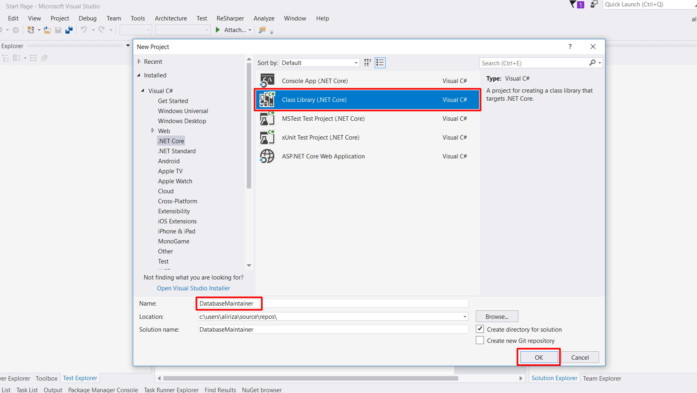
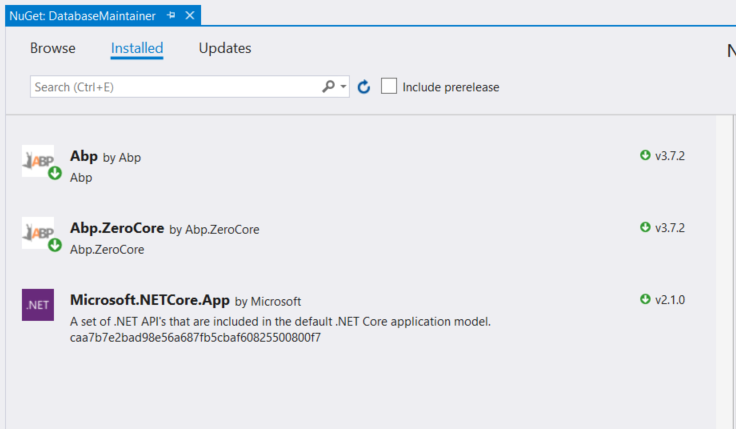
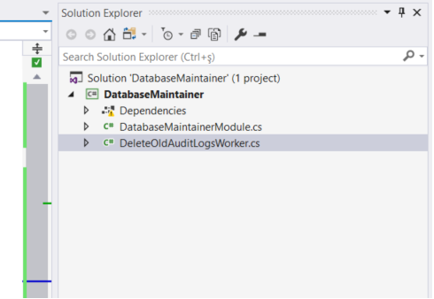
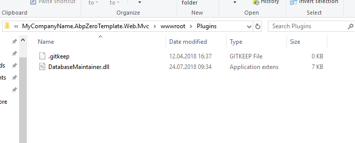
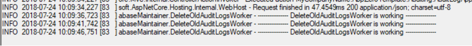

### Introduction

In this tutorial, a plugin example will be developed to learn how to create a plugin and use it in an application. This plugin that is named `DatabaseMaintainer` will remove audit logs in a given period.

### Create a Plugin

- Create a class library project



**NOTE:** `Abp` and `Abp.ZeroCore` packages are needed in this plugin.



- Add a module that is inherited from `AbpModule`

```c#
using System.Reflection;
using Abp.Modules;
using Abp.Threading.BackgroundWorkers;
using Abp.Zero;

namespace DatabaseMaintainer
{
    [DependsOn(typeof(AbpZeroCoreModule))]
    public class DatabaseMaintainerModule : AbpModule
    {
        public override void Initialize()
        {
            IocManager.RegisterAssemblyByConvention(Assembly.GetExecutingAssembly());
        }

        public override void PostInitialize()
        {
            var workManager = IocManager.Resolve<IBackgroundWorkerManager>();
            workManager.Add(IocManager.Resolve<DeleteOldAuditLogsWorker>());
        }
    }
}
```

- Add a background worker

````c#
using System;
using Abp.Auditing;
using Abp.Dependency;
using Abp.Domain.Repositories;
using Abp.Domain.Uow;
using Abp.Threading.BackgroundWorkers;
using Abp.Threading.Timers;
using Abp.Timing;

namespace DatabaseMaintainer
{
    public class DeleteOldAuditLogsWorker : PeriodicBackgroundWorkerBase, ISingletonDependency
    {
        private readonly IRepository<AuditLog, long> _auditLogRepository;

        public DeleteOldAuditLogsWorker(AbpTimer timer, IRepository<AuditLog, long> auditLogRepository)
            : base(timer)
        {
            _auditLogRepository = auditLogRepository;
            Timer.Period = 5000;
        }

        [UnitOfWork]
        protected override void DoWork()
        {
            Logger.Info("---------------- DeleteOldAuditLogsWorker is working ----------------");

            using (CurrentUnitOfWork.DisableFilter(AbpDataFilters.MayHaveTenant))
            {
                var fiveMinutesAgo = Clock.Now.Subtract(TimeSpan.FromMinutes(5));

                _auditLogRepository.Delete(log => log.ExecutionTime > fiveMinutesAgo);

                CurrentUnitOfWork.SaveChanges();
            }
        }
    }
}
````

Project solution looks like the following:



#### Build the Plugin

Build project in release mode. `DatabaseMaintainer.dll` will be created in the folder
`DatabaseMaintainer\DatabaseMaintainer\bin\Release\netcoreapp2.1`.

### Add Plugin to the Application

In the following example, it will be loaded from the `wwwroot` folder. You can change the plugins folder location.
First, the following line should be added to the `Startup.cs` of the application (MVC or Host) that you want to add the plugin to.

```c#
options.PlugInSources.AddFolder(Path.Combine(_hostingEnvironment.WebRootPath, "Plugins"), SearchOption.AllDirectories);
```

Latest Startup.cs  

```c#
public class Startup
{
    private readonly IConfigurationRoot _appConfiguration;

    public Startup(IHostingEnvironment env)
    {
        _appConfiguration = env.GetAppConfiguration();
    }

    public IServiceProvider ConfigureServices(IServiceCollection services)
    {
        ...

        // Configure Abp and Dependency Injection
        return services.AddAbp<AbpProjectNameWebMvcModule>(
            // Configure Log4Net logging
            options => options.IocManager.IocContainer.AddFacility<LoggingFacility>(
                f => f.UseAbpLog4Net().WithConfig("log4net.config")
            );

            options.PlugInSources.AddFolder(Path.Combine(_hostingEnvironment.WebRootPath, "Plugins"), SearchOption.AllDirectories);
        );
    }

    ...
}
```

And copy `DatabaseMaintainer.dll` from plugin to application `.Mvc/wwwroot/Plugins` folder.



### Run the Application

Run the project and see Logs.txt to check if it works.


