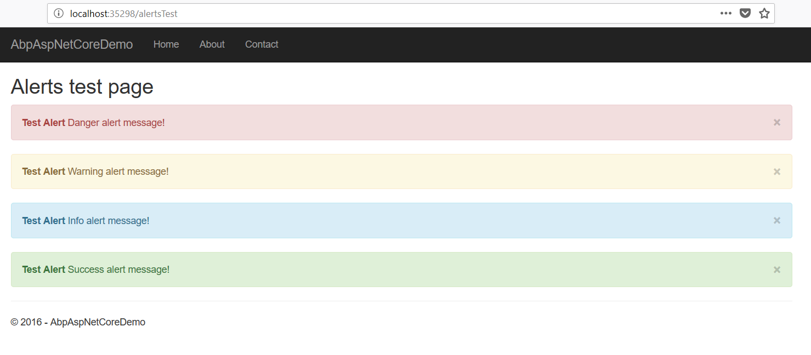

### Introduction

Alerts is a common way to show messages to the user after a web request. Examples:



ASP.NET Boilerplate provides a simple alert infrastructure for **MVC** applications (both for ASP.NET Core MVC & ASP.NET MVC 5.x).

> UI Alert system is designed for the actions those return **views**. An action returns a JSON/object result can not use the UI alert system (because it's something related to UI rather than APIs).

### Add Alerts

`IAlertManager` can be injected and used to add alerts into its `Alerts` collection. `AbpControllerBase` and `AbpPageModel`  base classes already injects it and have a shortcut to use the `Alerts` collection.

> All alert messages added in the same web request are added in the same collection even if they are added by different classes/controllers/services.

Example MVC Controller action (that produces the output shown in the figure above):

```c#
public class AlertsTestController : AbpControllerBase
{
    public IActionResult Index()
    {
        Alerts.Danger("Danger alert message!", "Test Alert");
        Alerts.Warning("Warning alert message!", "Test Alert");
        Alerts.Info("Info alert message!", "Test Alert");
        Alerts.Success("Success alert message!", "Test Alert");

        return View();
    }
}
```

### Show Alerts

MVC based [startup templates](https://aspnetboilerplate.com/Templates) already shows alerts on the page by default. So, nothing to do if you are using one of the startup templates.

If you want to access to the alerts added by the current request, you can always inject the `IAlertManager` and use its `Alerts` collection.