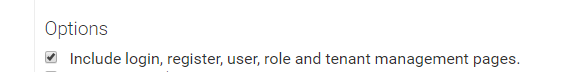

### Role Entity

The Role entity represents a **role for the application**. It should be
derived from the **AbpRole** class as shown below:

    public class Role : AbpRole<Tenant, User>
    {
        //add your own role properties here
    }

This class will be created when you download an ABP template with the option in the below image is selected.

Roles are
stored in the **AbpRoles** table in the database. You can add your own custom
properties to the Role class (and create database migrations for the
changes).

AbpRole defines some properties. The most important are:

-   **Name**: Unique name of the role in the tenant.
-   **DisplayName**: Shown name of the role.
-   **IsDefault**: Is this role assigned to new users by default?
-   **IsStatic**: Is this role static? (setup during pre-build, and can not be
    deleted).

Roles are used to **group permissions**. When a user has a role, then
he/she will have all the permissions of that role. A user can have
**multiple** roles. The Permissions of this user will be a merge of all the
permissions of all assigned roles.

#### Dynamic vs Static Roles

In Module Zero, roles can be dynamic or static:

-   **Static role**: A static role has a known **name** (like 'admin')
    which can not be changed (we can change the **display name**). It
    exists on the system startup and can not be deleted. This way, we can
    write code based on a static role's name.
-   **Dynamic (non static) role**: We can create a dynamic role after
    deployment. We can then grant permissions for that role, we can
    assign the role to some users, and we can delete it. We do not know the
    names of dynamic roles during development.

Use the **IsStatic** property to set it for a role. We must also
**register** static roles in
the [PreInitialize](/Pages/Documents/Module-System) method of our module. Assume
that we have an "Admin" static role for tenants:

    Configuration.Modules.Zero().RoleManagement.StaticRoles.Add(new StaticRoleDefinition("Admin", MultiTenancySides.Tenant));

This way, Module Zero will be aware of static roles.

#### Default Roles

One or more roles can be set as **default**. Default roles are assigned
to newly added/registered users by default. This is not a development time
property and can be set or changed after deployment. Use the **IsDefault**
property to set it.

### Role Manager

**RoleManager** is a service to perform **domain logic** for roles:

    public class RoleManager : AbpRoleManager<Tenant, Role, User>
    {
        //...
    }

You can [inject](/Pages/Documents/Dependency-Injection) and use
the RoleManager to create, delete, update roles, grant permissions for roles
and much more. You can add your own methods here, too. You can also
**override** any method of the **AbpRoleManager** base class for your own
needs.

Like the UserManager, some methods of the RoleManager also return IdentityResult
as a result instead of throwing exceptions. See the [user
management](/Pages/Documents/Zero/User-Management) document for more
information.

### Multi-Tenancy

Similar to user management, role management also works for a tenant
in a multi-tenant application. See the [user
management](/Pages/Documents/Zero/User-Management#multi-tenancy)
document for more information.