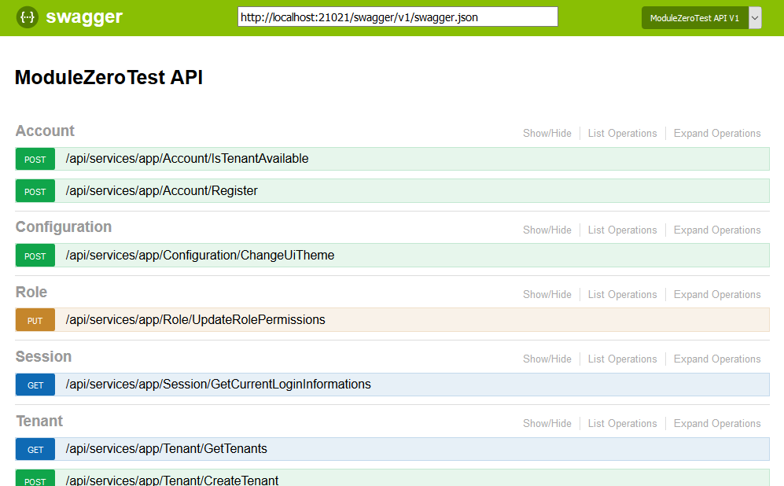
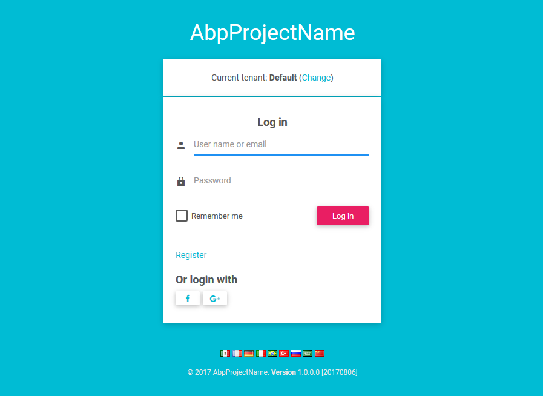
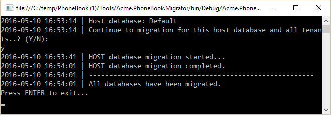

### Introduction

The easiest way of starting a new project using ABP with **ASP.NET Core** and **Angular** is to create a
template on the [download page](/Templates). After creating and downloading your project, follow the
below steps to run your application.

### ASP.NET Core Application

-   Open your solution in **Visual Studio 2017 v15.3.5+** and **build**
    the solution.
-   Select the '**Web.Host**' project as the **startup project**.
-   Check the **connection string** in the **appsettings.json** file of the Web.Host project, change it if you need to.
-   Open the **Package Manager Console** and run an **Update-Database** command
    to create your database (ensure that the Default project is selected as
    **.EntityFrameworkCore** in the Package Manager Console window).
-   Run the application. It will show **swagger-ui** if it is successful:

In this template, **multi-tenancy is enabled by default**. If you don't
need it, you can disable it in the Core project's module class.

If you have problems with running the application, close and then re-open
Visual Studio again. It sometimes fails on the first package restore.

### Angular Application

#### Requirements

The Angular application needs the following tools installed:

-   [nodejs](https://nodejs.org/en/download/) 6.9+ with npm 3.10+
-   Typescript 2.0+

We used the [angular-cli](https://cli.angular.io/) to develop the Angular
application.

#### Restore Packages

Open a command prompt, navigate to the **angular** folder which contains
the \*.sln file and run the following command to **restore the npm packages**:

    npm install

Note that the npm install may show some warning messages. This is not
related to our solution and generally it's not a problem. The solution
can also configured to work with [**yarn**](https://yarnpkg.com/) and we
recommend you use it if it is available on your computer.

#### Run The Application

In your opened command prompt, run the following command:

    npm start

Once the application has compiled, you can go to <http://localhost:4200> in
your browser. Be sure that the Web.Host application is running at the same
time. When you open the application, you will see the **login page**:

The Angular client app also has **HMR** (Hot Module Replacement) enabled.
You can use the following command (instead of npm start) to enable HMR
at development time:

    npm run hmr

#### Login

You can now login to the application using the default credentials. The default username
is '**admin**' and the password is '**123qwe**'. If you want to
login as a tenant, you need to first switch to that tenant on the login page. By default, there
is a tenant named "Default". Once you login successfully, you will
see a dashboard:

This dashboard is just for demonstration purposes and is meant to be a base for your
actual dashboard.

#### Deployment of Angular Application

We used the **angular-cli** tooling to build an Angular solution. You can use the
`ng build --prod` command to publish your project. It publishes to the **dist**
folder by default. You can then host this folder on IIS or any web
server you like.

##### Merged Project

If you have merged Angular UI project into ASP.NET Core project then you only need to publish your .Host project. After publish .Host project, you should copy files that are in .Host/wwwroot/dist folder to publish_folder/wwwroot. For example: Move files in .Host/wwwroot/dist to C:\inetpub\wwwroot\my-website\wwwroot

### Solution Details & Other Features

#### Token-Based Authentication

If you want to consume APIs/application services from a mobile
application, you can use the token based authentication mechanism just like
we do for the Angular client. The startup template includes the JwtBearer token
authentication infrastructure.

We will use **Postman** (a chrome extension) to demonstrate
requests and responses.

##### Authentication

Just send a **POST** request to
**http://localhost:21021/api/TokenAuth/Authenticate** with the
**Content-Type="application/json"** header as shown below:

We sent the values **usernameOrEmailAddress** and **password**. As seen
above, the result property of the returning JSON will contain the token and expiration
time (this is 24 hours by default and can be configured). We can save
it and use it for the next requests.

##### About Multi-Tenancy  

The **API will work as host users by default**. You can send the **Abp.TenantId**
header value to work with a specified tenant. It's an integer value and by default is
1 for the default tenant.

##### Using The API

After we authenticate and get the **token**, we can use it to call any
**authorized** action. All **application services** can be
used remotely. For example, we can use the **User service** to get a
**list of users**:

We made a **GET** request to
**http://localhost:21021/api/services/app/user/getAll** with
**Content-Type="application/json"** and **Authorization="Bearer
*your-******auth-token*** **"**. All the functionality available on the UI is
also available as the API.

#### Migrator Console Application

The startup template includes a tool, Migrator.exe, to easily migrate your
databases. You can run this application to create/migrate the host and
tenant databases.

This application gets the host connection string from its **own
appsettings.json file**. In the beginning, it will be the same as the appsettings.json
in the .Web.Host project. Be sure that the connection string
in the config file is the database you want. After getting the **host**
**connection string**, it first creates the host database and then applies the
migrations if they don't already exist. It then gets the connection strings of
the tenant databases and runs the migrations for those databases. It skips a
tenant if it does not have a dedicated database or if the database has already
been migrated by another tenant (for databases shared between multiple tenants).

You can use this tool on the development or production environment to
migrate the databases on deployment instead of using EntityFramework's own
tooling (which requires some configuration and can work only for a single
database/tenant in one run).

#### Unit Testing

The startup template includes the test infrastructure setup and a few tests
under the .Test project. You can check them and write similar tests
easily. Actually, they are integration tests rather than unit tests
since they test your code with all of ASP.NET Boilerplate's infrastructure
(including validation, authorization, unit of work...).

### Source Code

This template is developed as an open source project and is available for free on GitHub:
<https://github.com/aspnetboilerplate/module-zero-core-template>
