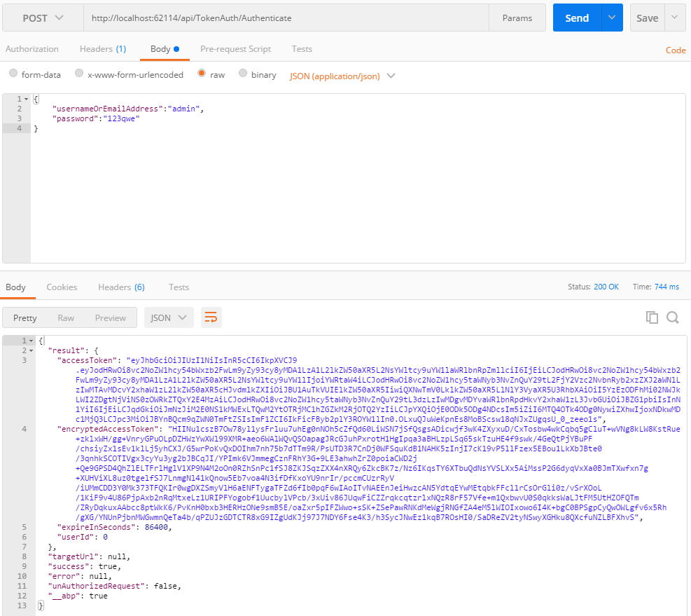
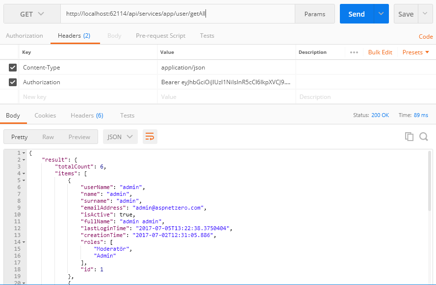

### Introduction

The easiest way of starting a new project using ABP with **ASP.NET Core MVC** is to create a template on the [download page](/Templates). After creating and downloading your project, follow the steps below to run your application.

-   Open your solution in **Visual Studio 2017 v15.3.5+** and **build**
    the solution.
-   Select the '**Web.Mvc**' project as the startup project.
-   Check the **connection string** in the **appsettings.json** file of the Web.Mvc project, change it if you want.
-   Open **Package Manager Console** and run the **Update-Database** command
    to create your database (ensure that the Default project is selected as
    **.EntityFrameworkCore** in the Package Manager Console window).
-   Run the application.

If you have problems with running the application, please try closing and
opening Visual Studio again. It sometimes fails on first package
restore.

#### Login

Once you run the application, you will see the following login page:

The username is '**admin**' and the password is '**123qwe**' by default. There
is also a "Default" tenant. After you login, you can see the
sample dashboard page:

#### About Multi-Tenancy

In this template, **multi-tenancy is enabled by default**. You can
disable it in Core project's module class if you don't need it.

### Token Based Authentication

The startup template uses cookie-based authentication for browsers. However,
if you want to consume Web APIs or application services (those that are
exposed via the [dynamic web api](/Pages/Documents/Dynamic-Web-API)) from a
mobile application, you'll probably want a token-based authentication
mechanism. The startup template includes JwtBearer token authentication
infrastructure.

Here, **Postman** (Chrome extension) will be used to demonstrate
requests and responses.

#### Authentication

Just send a **POST** request to
**http://localhost:62114/api/TokenAuth/Authenticate** with a
**Content-Type="application/json"** header as shown below:

We sent the values **usernameOrEmailAddress** and **password**. As seen
above, the result property of the returning JSON contains the token and expiration
time (which is 24 hours by default and can be configured). We can save
it and use for the next requests.

**About Multi-Tenancy  
**The API will work as host users by default. You can send a **Abp.TenantId**
header value to work with a specified tenant. It's an integer value and
1 for the default tenant by default.

#### Use API

After you authenticate and get the **token**, we can use it to call any
**authorized** action. All **application services** can be
used remotely. For example, we can use the **User service** to get a
**list of users**:

Just made a **GET** request to
**http://localhost:62114/api/services/app/user/GetAll** with
**Content-Type="application/json"** and **Authorization="Bearer
*your-*** ***auth-token*** **"**.

Almost all operations available on the UI are also available as a Web API,
since the UI uses the same Web API, and can be easily consumed.

### Migrator Console Application

The startup template includes a tool, Migrator.exe, to easily migrate your
databases. You can run this application to create/migrate the host and
tenant databases.

This application gets the host connection string from it's **own
appsettings.json file**. In the beginning, it will be the
same in the appsettings.json in the .Web.Host project.
Be sure that the connection string
in the config file is the database you want. After getting the **host**
**connection string**, it first creates the host database and applies
migrations if they don't already exist. It then gets the connection strings of the
tenant databases and runs migrations against those databases. It skips a
tenant if it does not have a dedicated database or its database has already
been migrated by another tenant (for shared databases between multiple
tenants).

You can use this tool on the development or on the production environment to
migrate databases on deployment instead of EntityFramework's own
tooling (which requires some configuration and can only work for a single
database/tenant in one run).

### Unit Testing

The startup template includes the test infrastructure setup and a few tests
under the .Test project. You can check them and write similar tests
easily. They are actually integration tests rather than unit tests,
since they test your code with all the ASP.NET Boilerplate infrastructure
(including validation, authorization, unit of work...).

### Source Code

This template is developed as an open source project and is available for free on GitHub:
<https://github.com/aspnetboilerplate/module-zero-core-template>
