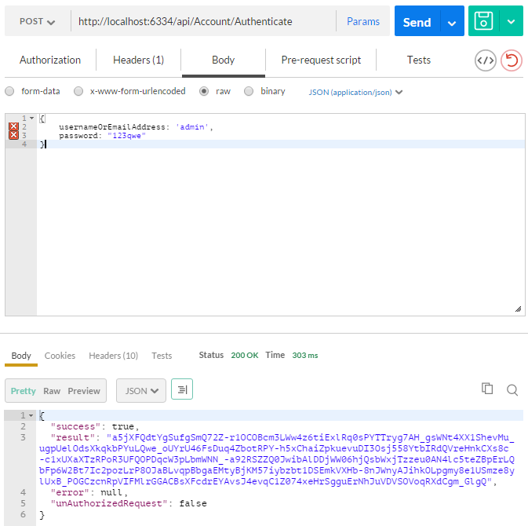

### Introduction

The easiest way of starting a new project using ABP and module-zero is
to create a template on [templates page](/Templates). Remember to check
"**Include module zero**".

After creating and downloading your project,

-   Open your solution on Visual Studio 2017 v15.3.5+.
-   Select the '**Web**' project as startup project.
-   Open Package Manager Console, select '**EntityFramework**' project
    as **Default project** and run the EntityFramework's
    '**Update-Database**' command. This will create the database. You
    can change **connection string** from web.config.
-   Run the application. User name is '**admin**' and password is
    '**123qwe**' as default.

Be sure you have installed Typescript 2.0+ for your Visual Studio
because Abp.Web.Resources nuget package comes with d.ts and it requires
Typescript 2.0+.

In this template, **multi-tenancy is enabled by default**. You can
disable it in Core project's module class if you don't need.

### Token Based Authentication

Startup template uses cookie based authentication for browsers. However,
if you want to consume Web APIs or application services (those are
exposed via [dynamic web api](/Pages/Documents/Dynamic-Web-API)) from a
mobile application, you probably want a token based authentication
mechanism. Startup template includes bearer token authentication
infrastructure. **AccountController** in **.WebApi** project contains
**Authenticate** action to get the token. Then we can use the token for
next requests.

Here, **Postman** (chrome extension) will be used to demonstrate
requests and responses.

#### Authentication

Just send a **POST** request to
**http://localhost:6334/api/Account/Authenticate** with
**Context-Type="application/json"** header as shown below:

We sent a **JSON request body** includes **userNameOrEmailAddress** and
**password**. Also, **tenancyName** should be sent for **tenant** users.
As seen above, **result** property of returning JSON contains the token.
We can save it and use for next requests.

#### Use API

After authenticate and get the **token**, we can use it to call any
**authorized** action. All **application services** are available to be
used remotely. For example, we can use the **Tenant service** to get a
**list of tenants**:

Just made a **POST** request to
**http://localhost:6334/api/services/app/tenant/GetTenants** with
**Content-Type="application/json"** and **Authorization="Bearer
*your-*** ***auth-token*** **"**. Request body was just empty **{}**.
Surely, request and response body will be different for different APIs.

Almost all operations available on UI are also available as Web API
(since UI uses the same Web API) and can be consumed easily.

### Migrator Console Application

Startup template includes a tool, Migrator.exe, to easily migrate your
databases. You can run this application to create/migrate host and
tenant databases.

This application gets host connection string from it's **own .config
file**. It will be same in the web.config at the beggining. Be sure that
the connection string in config file is the database you want. After
getting **host** **connection sring**, it first creates the host
database or apply migrations if it does already exists. Then it gets
connection strings of tenant databases and runs migrations for those
databases. It skips a tenant if it has not a dedicated database or it's
database is already migrated for another tenant (for shared databases
between multiple tenants).

You can use this tool on development or on product environment to
migrate databases on deployment, instead of EntityFramework's own
Migrate.exe (which requires some configuration and can work for single
database in one run).

### Unit Testing

Startup template includes test infrastructure setup and a few tests
under the .Test project. You can check them and write similar tests
easily. Actually, they are integration tests rather than unit tests
since they tests your code with all ASP.NET Boilerplate infrastructure
(including validation, authorization, unit of work...).
