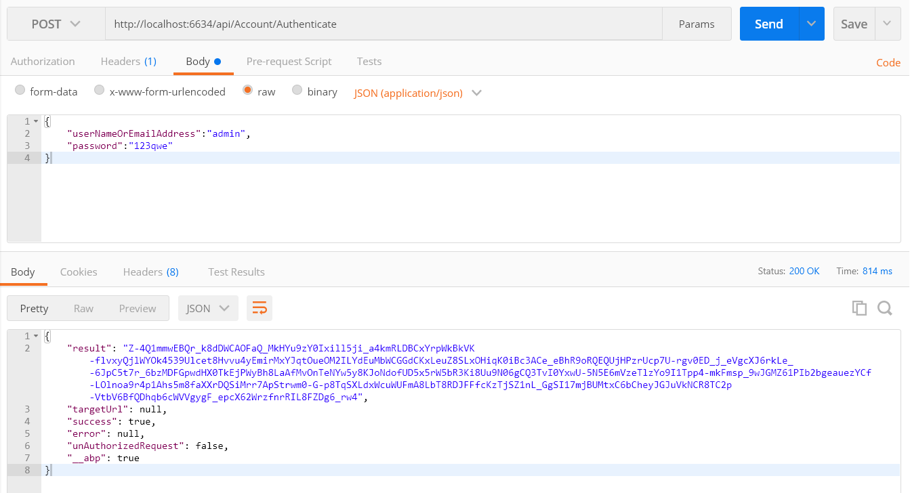
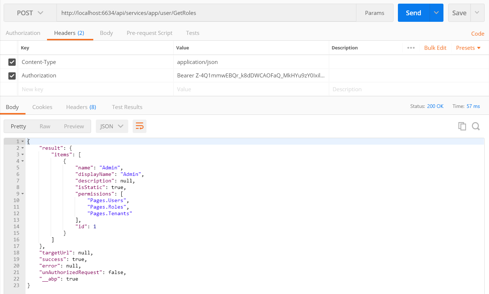

### Introduction

The easiest way of starting a new project using ABP with **ASP.NET MVC 5.x (and optionally AngularJS frontend)** is to create a template on the [download page](/Templates).

After creating and downloading your project:

-   Open your solution in Visual Studio 2017 v15.3.5+.
-   Select the '**Web**' project as the startup project.
-   Open the Package Manager Console, select the '**EntityFramework**' project
    as the **Default project** and run EntityFramework's
    '**Update-Database**' command. This will create the database. You
    can then change the **connection string** in the web.config.
-   Run the application. The default username is '**admin**' and the password is
    '**123qwe**'.

Be sure you have installed Typescript 2.0+ in Visual Studio
because the Abp.Web.Resources NuGet package comes with d.ts and it requires
Typescript 2.0+.

In this template, **multi-tenancy is enabled by default**. You can
disable it in the Core project's module class if you don't need it.

### Token-Based Authentication

The startup template uses cookie-based authentication for browsers. However,
if you want to consume Web APIs or application services (those that are
exposed via the [dynamic web api](/Pages/Documents/Dynamic-Web-API)) from a
mobile application, you probably want a token-based authentication
mechanism. The startup template includes the infrastructure for bearer-token
 authentication. The **AccountController** in the **.WebApi** project contains
an **Authenticate** action to get the token. We can then use the token for the
next requests.

Here **Postman** (a chrome extension) is used to demonstrate
requests and responses.

#### Authentication

Just send a **POST** request to
**http://localhost:6634/api/Account/Authenticate** with the
**Context-Type="application/json"** header as shown below:

We sent a **JSON request body** which includes a **userNameOrEmailAddress** and
**password**. **tenancyName** should also be sent for **tenant** users.
As seen above, the **result** property of the returning JSON contains the token.
We can save it and use it for the next requests.

#### Use API

After we authenticate and get the **token**, we can use it to call
**authorized** actions. All **application services** can be
used remotely. For example, we can use the **user service** to get a
**list of roles**:

We just made a **POST** request to
**http://localhost:6634/api/services/app/user/GetRoles** with
**Content-Type="application/json"** and **Authorization="Bearer
*your-*** ***auth-token*** **"** headers. The request body was empty **{}**.
For the most part, request and response bodies will be different for each API.

Almost all operations available on the UI are also available as a Web API,
since the UI uses the same Web API, and can be easily consumed.

### Migrator Console Application

The startup template includes a tool, Migrator.exe, to easily migrate your
databases. You can run this application to create/migrate the host and
tenant databases.

This application gets the host connection string from it's **own
appsettings.json file**. In the beginning, it will be the
same in the appsettings.json in the .Web.Host project.
Be sure that the connection string
in the config file is the database you want. After getting the **host**
**connection string**, it first creates the host database and applies
migrations if they don't already exist. It then gets the connection strings of the
tenant databases and runs migrations against those databases. It skips a
tenant if it does not have a dedicated database or its database has already
been migrated by another tenant (for shared databases between multiple
tenants).

You can use this tool on the development or on the production environment to
migrate databases on deployment instead of EntityFramework's own
tooling (which requires some configuration and can only work for a single
database/tenant in one run).

### Unit Testing

The startup template includes the test infrastructure setup and a few tests
under the .Test project. You can check them and write similar tests
easily. They are actually integration tests rather than unit tests,
since they test your code with all the ASP.NET Boilerplate infrastructure
(including validation, authorization, unit of work...).

### Source Code

This template is developed as an open source project and is available for free on GitHub:
<https://github.com/aspnetboilerplate/module-zero-template>
